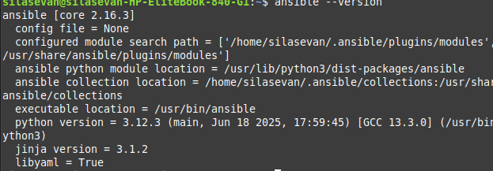
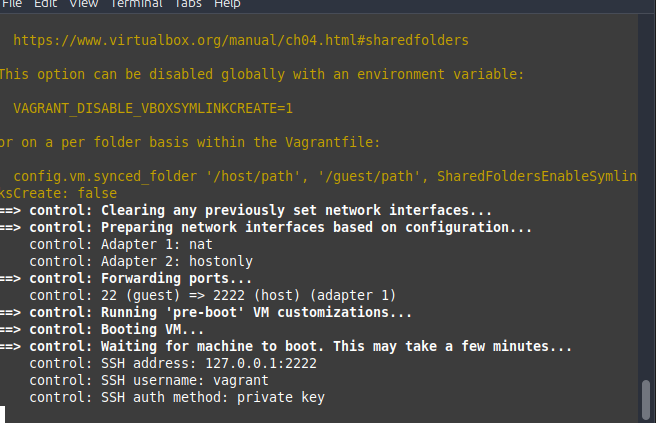
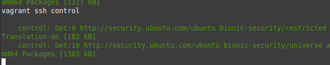
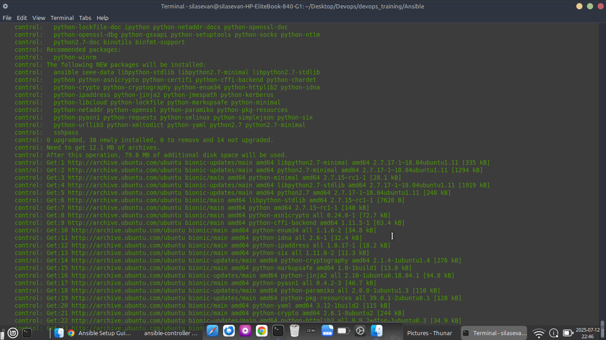
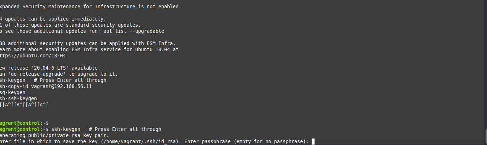
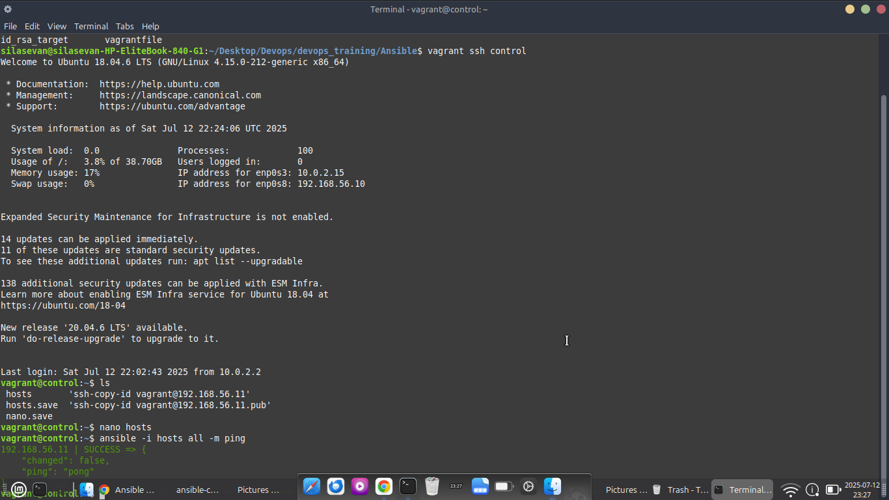
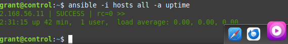
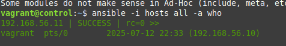
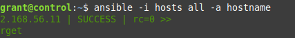

# 🔧 Ansible Lab Setup with Vagrant and VirtualBox

This project demonstrates how to set up a local Ansible lab using **Vagrant** and **VirtualBox**. The lab contains:

- A **Control Node**: where Ansible is installed and configured.
- A **Target Node**: which the control node manages using SSH and Ansible.

---

## 🛠️ Tools Used

- **Linux Mint 22.1 "Xia"**
- **VirtualBox**
- **Vagrant**
- **Ansible**

---

## 📦 Installation Steps

### 1. Install VirtualBox

```bash
sudo apt update
sudo apt install virtualbox
```

### 2. Install Vagrant

```bash
sudo apt install vagrant
```

---

## 📁 Project Directory Structure

```bash
ansible-vagrant-demo/
├── Vagrantfile
├── id_rsa_target        # Copied Vagrant private key for SSH access
└── hosts                # Ansible inventory file
```

---

## 🧱 Vagrantfile Configuration

```ruby
Vagrant.configure("2") do |config|

  # Control Node
  config.vm.define "control" do |control|
    control.vm.box = "ubuntu/bionic64"
    control.vm.hostname = "control"
    control.vm.network "private_network", ip: "192.168.56.10"
    control.vm.provision "shell", inline: <<-SHELL
      apt update
      apt install -y ansible sshpass
    SHELL
  end

  # Target Node
  config.vm.define "target" do |target|
    target.vm.box = "ubuntu/bionic64"
    target.vm.hostname = "target"
    target.vm.network "private_network", ip: "192.168.56.11"
  end

end
```

Start the machines:

```bash
vagrant up
```

---

## 🔐 SSH Key Setup

1. On host, copy target VM's private key to shared folder:

```bash
cp .vagrant/machines/target/virtualbox/private_key id_rsa_target
```

2. Inside the control node:

```bash
cp /vagrant/id_rsa_target ~/.ssh/id_rsa_target
chmod 600 ~/.ssh/id_rsa_target
```

---

## 📋 Ansible Inventory File

Create a file called `hosts` inside the control node:

```ini
[target]
192.168.56.11 ansible_user=vagrant ansible_ssh_private_key_file=~/.ssh/id_rsa_target ansible_python_interpreter=/usr/bin/python3
```

---

## 🐍 Install Python on Target

Ansible needs Python installed on the target VM. Use the `raw` module:

```bash
ansible -i hosts all -m raw -a "sudo apt update && sudo apt install -y python3"
```

---

## ✅ Test Ansible Connection

```bash
ansible -i hosts all -m ping
```

Expected output:

```json
192.168.56.11 | SUCCESS => {
    "changed": false,
    "ping": "pong"
}
```

---

## ⚡ Sample Ansible Ad-Hoc Commands

| Description             | Command |
|-------------------------|---------|
| Uptime                  | `ansible -i hosts all -a "uptime"` |
| Disk Usage              | `ansible -i hosts all -a "df -h"` |
| Install nginx           | `ansible -i hosts all -m apt -a "name=nginx state=present update_cache=yes"` |
| Create a directory      | `ansible -i hosts all -m file -a "path=/tmp/demo_dir state=directory"` |
| Check memory usage      | `ansible -i hosts all -a "free -m"` |
| Create a user           | `ansible -i hosts all -m user -a "name=testuser state=present"` |

---

## 🖼️ Screenshots




### 🔹 Ansible ping


### 🔹 Sample Ad-Hoc Command Output











---

## ✅ Next Steps (Optional)

- Create your first Ansible playbook
- Add more target nodes
- Automate software installations

---

## 🙌 Author

Silas Evan — DevOps Student