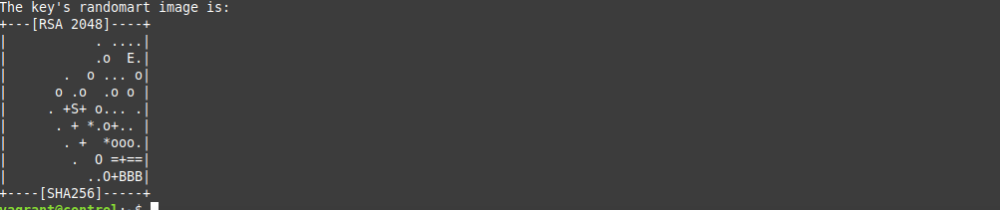
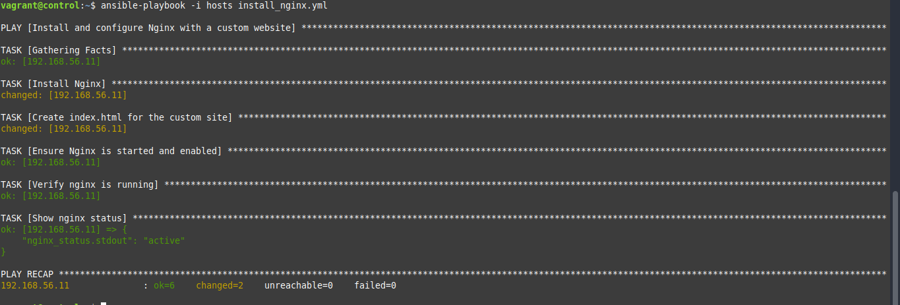
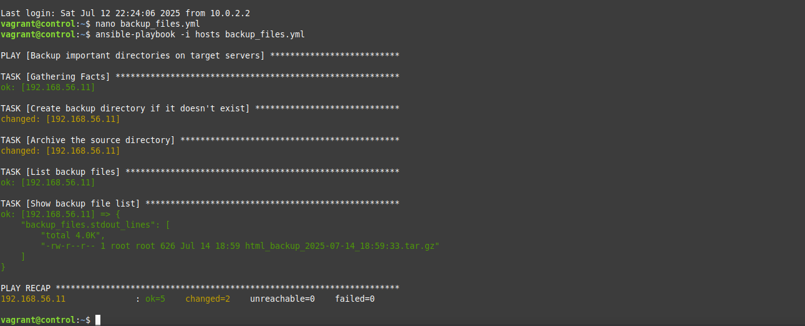

# 🔧 Ansible Lab Setup with Vagrant and VirtualBox

This project demonstrates how to set up a local Ansible lab using **Vagrant** and **VirtualBox**. The lab contains:

- A **Control Node**: where Ansible is installed and configured.
- A **Target Node**: which the control node manages using SSH and Ansible.

---

## 🛠️ Tools Used

- **Linux Mint 22.1 "Xia"**
- **VirtualBox**
- **Vagrant**
- **Ansible**

---

## 📦 Installation Steps

### 1. Install VirtualBox

```bash
sudo apt update
sudo apt install virtualbox
```

### 2. Install Vagrant

```bash
sudo apt install vagrant
```

---

## 📁 Project Directory Structure

```bash
ansible-vagrant-demo/
├── Vagrantfile
├── id_rsa_target        # Copied Vagrant private key for SSH access
├── hosts                # Ansible inventory file
└── user_setup.yml       # Ansible playbook to create user with SSH access
```

---

## 🧱 Vagrantfile Configuration

```ruby
Vagrant.configure("2") do |config|

  # Control Node
  config.vm.define "control" do |control|
    control.vm.box = "ubuntu/bionic64"
    control.vm.hostname = "control"
    control.vm.network "private_network", ip: "192.168.56.10"
    control.vm.provision "shell", inline: <<-SHELL
      apt update
      apt install -y ansible sshpass
    SHELL
  end

  # Target Node
  config.vm.define "target" do |target|
    target.vm.box = "ubuntu/bionic64"
    target.vm.hostname = "target"
    target.vm.network "private_network", ip: "192.168.56.11"
  end

end
```

Start the machines:

```bash
vagrant up
```

---

## 🔐 SSH Key Setup

1. On host, copy target VM's private key to shared folder:

```bash
cp .vagrant/machines/target/virtualbox/private_key id_rsa_target
```

2. Inside the control node:

```bash
cp /vagrant/id_rsa_target ~/.ssh/id_rsa_target
chmod 600 ~/.ssh/id_rsa_target
```

---

## 📋 Ansible Inventory File

Create a file called `hosts` inside the control node:

```ini
[target]
192.168.56.11 ansible_user=vagrant ansible_ssh_private_key_file=~/.ssh/id_rsa_target ansible_python_interpreter=/usr/bin/python3
```

---

## 🐍 Install Python on Target

Ansible needs Python installed on the target VM. Use the `raw` module:

```bash
ansible -i hosts all -m raw -a "sudo apt update && sudo apt install -y python3"
```

---

## ✅ Test Ansible Connection

```bash
ansible -i hosts all -m ping
```

Expected output:

```json
192.168.56.11 | SUCCESS => {
    "changed": false,
    "ping": "pong"
}
```

---

## ⚡ Sample Ansible Ad-Hoc Commands

| Description             | Command |
|-------------------------|---------|
| Uptime                  | `ansible -i hosts all -a "uptime"` |
| Disk Usage              | `ansible -i hosts all -a "df -h"` |
| Install nginx           | `ansible -i hosts all -m apt -a "name=nginx state=present update_cache=yes"` |
| Create a directory      | `ansible -i hosts all -m file -a "path=/tmp/demo_dir state=directory"` |
| Check memory usage      | `ansible -i hosts all -a "free -m"` |
| Create a user           | `ansible -i hosts all -m user -a "name=testuser state=present"` |

---

## 📘 Ansible Playbook: User Creation with SSH and Group Setup

This playbook automates the creation of a user on the target server, configures their SSH access, and assigns them to a custom group and the `sudo` group.

### 📄 Playbook File: `user_setup.yml`

```yaml
- name: Create a user with SSH and group setup
  hosts: all
  become: yes

  vars:
    username: devuser
    user_group: devops
    ssh_pub_key: "ssh-rsa AAAAB3NzaC1yc2EAAAADAQABAAABAQDhDUMMY_KEY_HERE123456789 user@control"

  tasks:
    - name: Ensure the group exists
      group:
        name: "{{ user_group }}"
        state: present

    - name: Ensure the user exists
      user:
        name: "{{ username }}"
        group: "{{ user_group }}"
        groups: sudo
        append: yes
        shell: /bin/bash
        create_home: yes
        state: present

    - name: Create .ssh directory for the user
      file:
        path: "/home/{{ username }}/.ssh"
        state: directory
        owner: "{{ username }}"
        group: "{{ user_group }}"
        mode: '0700'

    - name: Add authorized SSH key for the user
      copy:
        content: "{{ ssh_pub_key }}"
        dest: "/home/{{ username }}/.ssh/authorized_keys"
        owner: "{{ username }}"
        group: "{{ user_group }}"
        mode: '0600'

    - name: Ensure user was created
      command: id {{ username }}
      register: user_id_output
      changed_when: false

    - name: Show user ID output
      debug:
        var: user_id_output.stdout
```

### ✅ How to Run the Playbook

```bash
ansible-playbook -i hosts user_setup.yml
```

### 🔐 Test SSH Access

From your host machine (with the corresponding private key):

```bash
ssh devuser@192.168.56.11
```

Make sure your public key is correctly set in the playbook.

---

## 🖼️ Screenshots


### 🔹 SSH key copied


### 🔹 Ansible ping


### 🔹 Sample Ad-Hoc Command Output





---

## ⚡ Sample Ansible Ad-Hoc Commands

| Description             | Command |
|-------------------------|---------|
| Uptime                  | `ansible -i hosts all -a "uptime"` |
| Disk Usage              | `ansible -i hosts all -a "df -h"` |
| Install nginx           | `ansible -i hosts all -m apt -a "name=nginx state=present update_cache=yes"` |
| Create a directory      | `ansible -i hosts all -m file -a "path=/tmp/demo_dir state=directory"` |
| Check memory usage      | `ansible -i hosts all -a "free -m"` |
| Create a user           | `ansible -i hosts all -m user -a "name=testuser state=present"` |

---

## 📘 Ansible Playbook: User Creation with SSH and Group Setup

This playbook automates the creation of a user on the target server, configures their SSH access, and assigns them to a custom group and the `sudo` group.

### 📄 Playbook File: `user_setup.yml`

```yaml
- name: Create a user with SSH and group setup
  hosts: all
  become: yes

  vars:
    username: devuser
    user_group: devops
    ssh_pub_key: "ssh-rsa AAAAB3NzaC1yc2EAAAADAQABAAABAQDhDUMMY_KEY_HERE123456789 user@control"

  tasks:
    - name: Ensure the group exists
      group:
        name: "{{ user_group }}"
        state: present

    - name: Ensure the user exists
      user:
        name: "{{ username }}"
        group: "{{ user_group }}"
        groups: sudo
        append: yes
        shell: /bin/bash
        create_home: yes
        state: present

    - name: Create .ssh directory for the user
      file:
        path: "/home/{{ username }}/.ssh"
        state: directory
        owner: "{{ username }}"
        group: "{{ user_group }}"
        mode: '0700'

    - name: Add authorized SSH key for the user
      copy:
        content: "{{ ssh_pub_key }}"
        dest: "/home/{{ username }}/.ssh/authorized_keys"
        owner: "{{ username }}"
        group: "{{ user_group }}"
        mode: '0600'

    - name: Ensure user was created
      command: id {{ username }}
      register: user_id_output
      changed_when: false

    - name: Show user ID output
      debug:
        var: user_id_output.stdout
```

### ✅ How to Run the Playbook

```bash
ansible-playbook -i hosts user_setup.yml
```

### 🔐 Test SSH Access

From your host machine (with the corresponding private key):

```bash
ssh devuser@192.168.56.11
```

Make sure your public key is correctly set in the playbook.

---
## 💾 Ansible Playbook: Backup Files and Directories

This playbook creates compressed backups of a specified directory on the target server. It also saves them to a backup directory with a timestamp.

### 📄 Playbook File: `backup_files.yml`

```yaml
- name: Backup important directories on target servers
  hosts: all
  become: yes

  vars:
    source_dir: /var/www/html
    backup_dir: /opt/backups
    timestamp: "{{ ansible_date_time.date }}_{{ ansible_date_time.time }}"

  tasks:
    - name: Create backup directory if it doesn't exist
      file:
        path: "{{ backup_dir }}"
        state: directory
        owner: root
        group: root
        mode: '0755'

    - name: Archive the source directory
      archive:
        path: "{{ source_dir }}"
        dest: "{{ backup_dir }}/{{ source_dir | basename }}_backup_{{ timestamp }}.tar.gz"
        format: gz
      tags: backup

    - name: List backup files
      command: ls -lh "{{ backup_dir }}"
      register: backup_files
      changed_when: false

    - name: Show backup file list
      debug:
        var: backup_files.stdout_lines
```

### ✅ How to Run the Playbook

```bash
ansible-playbook -i hosts backup_files.yml
```

### 🗂️ Example Output

```
html_backup_2025-07-14_19:55:00.tar.gz
```

Backups will be stored in `/opt/backups` by default.

---

# ♻️ Ansible Playbook: Restore a Backup

This playbook restores a previously created `.tar.gz` backup archive to a desired directory on the target server.

### 📄 Playbook File: `restore_backup.yml`

```yaml
- name: Restore backup from archive
  hosts: all
  become: yes

  vars:
    backup_dir: /opt/backups
    restore_dir: /var/www/html
    backup_filename: html_backup_2025-07-14_19:55:00.tar.gz  # Change this to match your backup

  tasks:
    - name: Ensure the restore directory exists
      file:
        path: "{{ restore_dir }}"
        state: directory
        mode: '0755'

    - name: Clean the restore directory before restoring
      file:
        path: "{{ restore_dir }}"
        state: absent
      ignore_errors: yes

    - name: Recreate the restore directory
      file:
        path: "{{ restore_dir }}"
        state: directory
        mode: '0755'

    - name: Extract backup archive to restore directory
      unarchive:
        src: "{{ backup_dir }}/{{ backup_filename }}"
        dest: "{{ restore_dir }}"
        remote_src: yes
        extra_opts: [--strip-components=1]

    - name: List files in the restored directory
      command: ls -l "{{ restore_dir }}"
      register: restore_files
      changed_when: false

    - name: Show restored file list
      debug:
        var: restore_files.stdout_lines
```

### ✅ How to Run the Playbook

```bash
ansible-playbook -i hosts restore_backup.yml
```

### 🛑 Important Note

Make sure the backup filename exists in `/opt/backups` on the target server. You can verify it by running:

```bash
ssh -i ~/.ssh/id_rsa_target vagrant@192.168.56.11
ls /opt/backups
```

Update the `backup_filename` in the playbook accordingly.

---
## 🖼️ Screenshots

### 🔹 Vagrant up success


### 🔹 SSH key copied


### 🔹 Ansible ping


### 🔹 Sample Ad-Hoc Command Output






---


---

## 🙌 Author

Silas Evan — DevOps Student