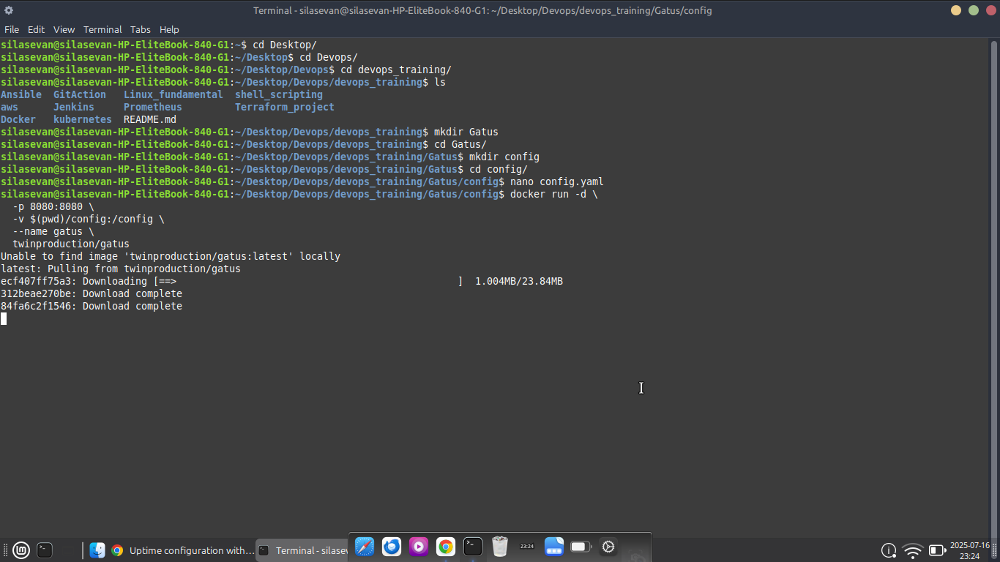
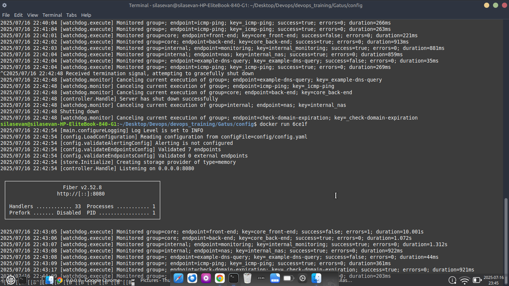
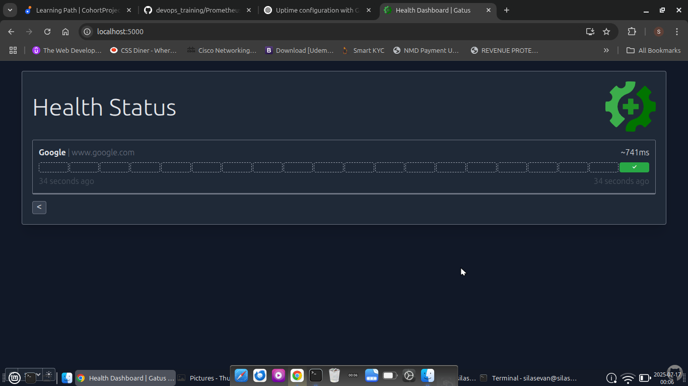
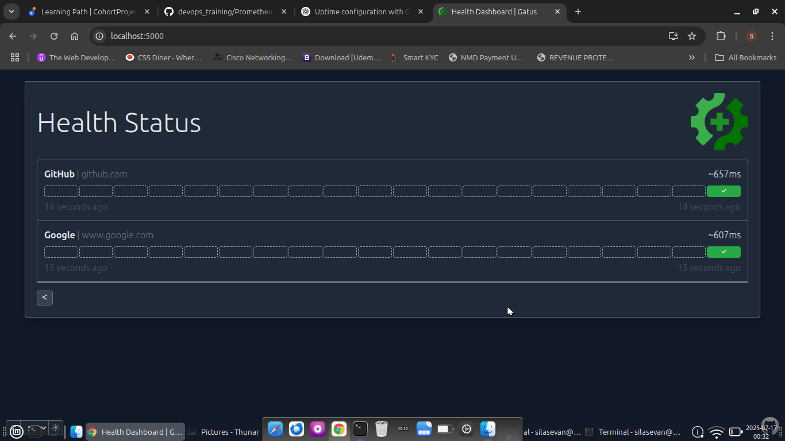
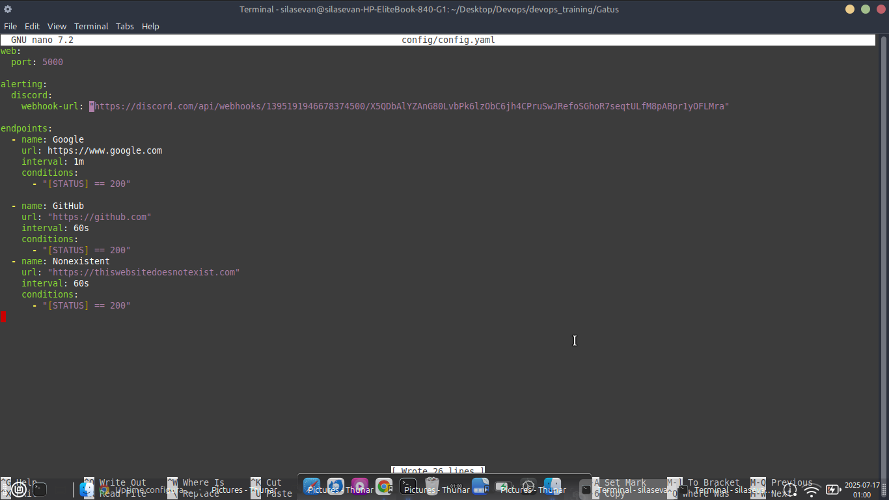
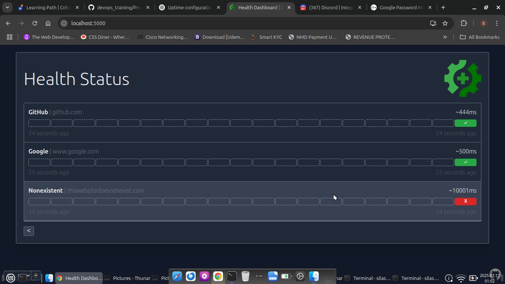
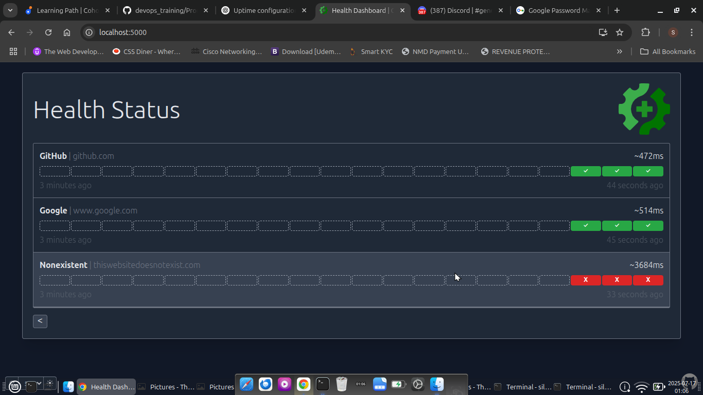

# 🚦 Gatus Uptime Monitoring with Docker and Discord Alerts

This mini-project sets up [Gatus](https://github.com/TwinProduction/gatus), a self-hosted uptime monitoring dashboard using Docker. It monitors websites and sends alerts to a Discord channel when an endpoint goes down or recovers.

---

## 📦 Features

- ⏱️ Monitor any website or HTTP service
- 🐳 Easy Docker-based setup
- 📢 Real-time alerts via Discord webhook
- 📊 Clean and responsive status dashboard
- 🔧 Configurable conditions and alert thresholds

---

## 📁 Folder Structure

```
Gatus/
├── config/
│   └── config.yaml
└── README.md
```

---

## 🚀 Getting Started

### 1. Clone or create project folder

```bash
mkdir gatus-monitor
cd gatus-monitor
mkdir config
```

### 2. Create `config.yaml`

Inside the `config/` folder, create a file called `config.yaml`:

```yaml
web:
  port: 8080

alerting:
  discord:
    webhook-url: "https://discord.com/api/webhooks/YOUR_WEBHOOK_ID/YOUR_TOKEN"

endpoints:
  - name: Google
    url: https://www.google.com
    interval: 1m
    conditions:
      - "[STATUS] == 200"
    alerts:
      - type: discord
        failure-threshold: 2
        success-threshold: 1
```

> ⚠️ Replace `YOUR_WEBHOOK_ID/YOUR_TOKEN` with your actual Discord webhook URL.

---

### 3. Run Gatus using Docker

From the root of your project folder:

```bash
docker run -d   -p 8080:8080   -v $(pwd)/config:/config   --name gatus   twinproduction/gatus
```

---

### 4. Open the Gatus Dashboard

Go to your browser and visit:

```
http://localhost:8080
```

You should see a live status page for your endpoints.

---

## 🔔 Discord Alerting

This setup sends alert messages to a Discord channel if:
- An endpoint fails 2 times in a row (as defined by `failure-threshold`)
- It recovers 1 time in a row (`success-threshold`)

You will receive alerts like:

```
❌ Google is DOWN
✅ Google has recovered
```

To get your webhook:
1. Go to your Discord server → Channel settings → Integrations → Webhooks
2. Create a webhook and copy the URL

---

## 🧪 Testing Alerts

To test alerts, temporarily use an invalid URL like:

```yaml
url: https://nonexistent.example.com
```

Then wait a couple of minutes to receive failure notifications in Discord.

---

## 📌 Stop or Restart Gatus

```bash
docker stop gatus
docker start gatus
```

Or remove it completely:

```bash
docker rm -f gatus
```

---

## 🧰 Requirements

- Docker installed on your system
- Internet connection
- A Discord server with a webhook configured

---

## 📸 Screenshot











---


---

