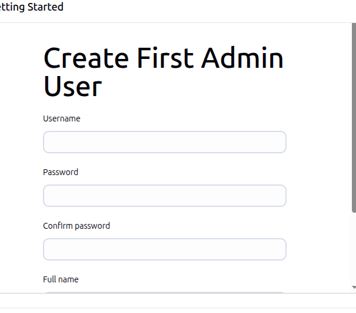
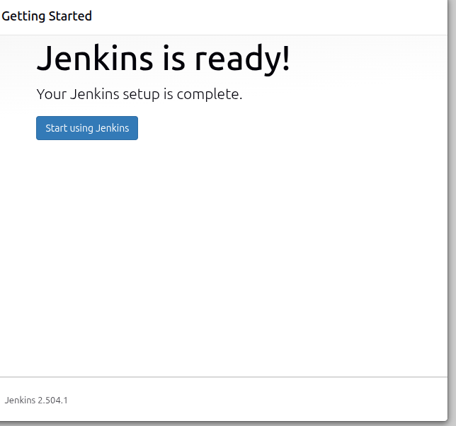
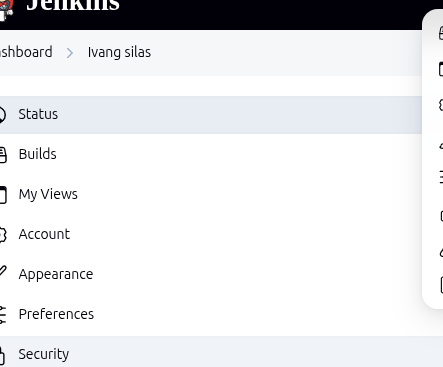
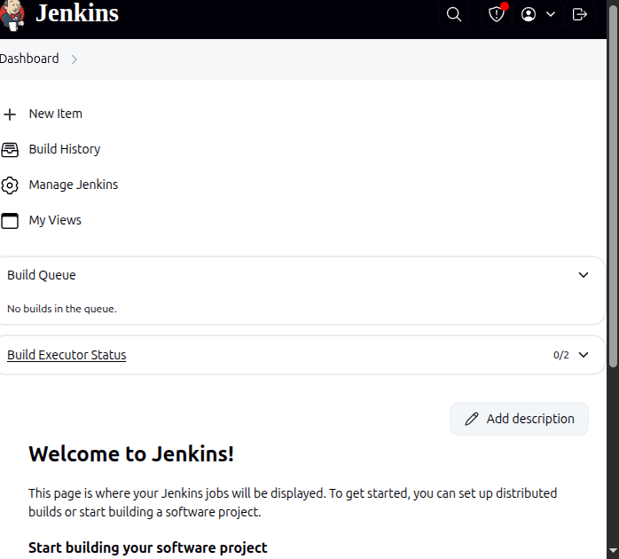
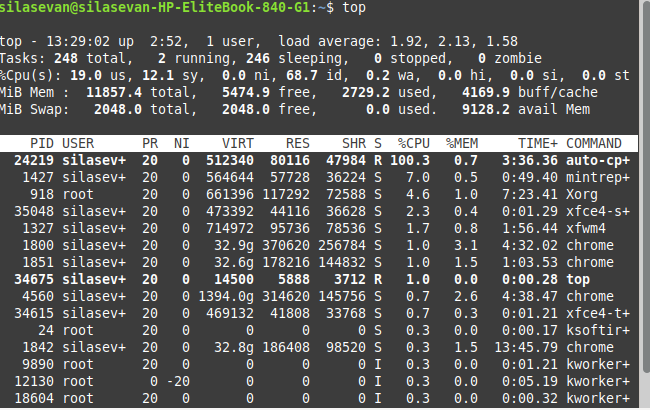

# Jenkins Installation on Linux Mint XFCE

This project documents the step-by-step installation and setup of [Jenkins](https://www.jenkins.io/) on a **Linux Mint XFCE** system. Jenkins is an open-source automation server used to automate building, testing, and deploying software.

---

## 🖥️ System Information

- **OS:** Linux Mint XFCE (Ubuntu-based)
- **Jenkins Version:** Latest Stable
- **Java Version:** OpenJDK 17
- **Installation Type:** Local installation (no cloud or container instance required)

---

## ⚙️ Installation Steps

### 1. Update System
```bash
sudo apt update && sudo apt upgrade -y

sudo apt install openjdk-17-jdk -y
java -version

### Add Jenkins GPG Key and Repository
curl -fsSL https://pkg.jenkins.io/debian-stable/jenkins.io-2023.key | sudo tee /usr/share/keyrings/jenkins-keyring.asc > /dev/null


echo "deb [signed-by=/usr/share/keyrings/jenkins-keyring.asc] https://pkg.jenkins.io/debian-stable binary/" | \
sudo tee /etc/apt/sources.list.d/jenkins.list > /dev/null

 ### Update and install Jenkins
sudo apt update
sudo apt install jenkins -y
### Access Jenkins
http://localhost:8080


### unlock jenkins
sudo cat /var/lib/jenkins/secrets/initialAdminPassword


### installing Plugins
Once inside Jenkins:

Go to Manage Jenkins > Manage Plugins

Browse available plugins

Install the ones you need (e.g., Git, Docker, GitHub)

## Useful Commands
### Check Jenkins status:

sudo systemctl status jenkins

### Restart Jenkins:


sudo systemctl restart jenkins


### Screenshots





