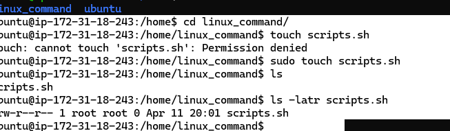
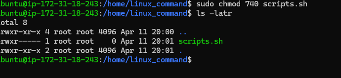
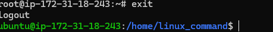
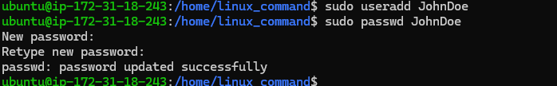
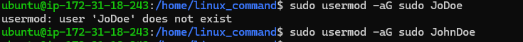
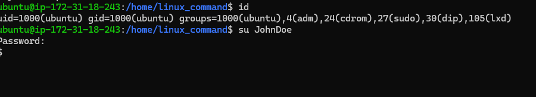
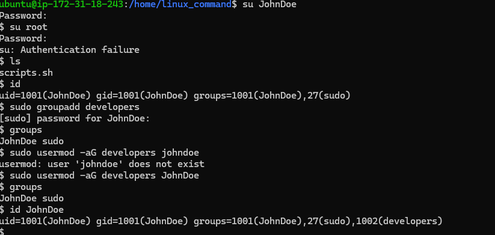
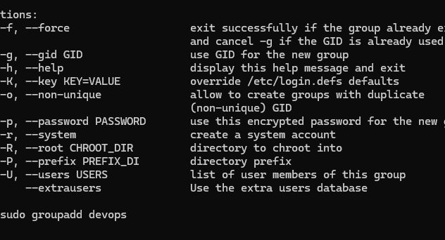

Linux System Administration: File Permissions, Ownership, and User Account Management
📘 Project Overview
This project explores foundational Linux system administration tasks essential for every aspiring system administrator or DevOps engineer. It focuses on managing file permissions, ownership, and user accounts/groups—all of which are crucial for maintaining system security and access control.

⚠️ Note: This project aligns precisely with the instructor’s requirements and does not include unrelated comparisons or demonstrations of text editors.

🧰 Tools Used
Operating System: Ubuntu 20.04 (Linux)

User Privileges: sudo access required

🗂️ Project Structure

.
├── README.md
├── screenshots/
│   ├── chmod_example.png
│   ├── chown_example.png
│   └── useradd_example.png
└── scripts/
    ├── create_user.sh
    ├── manage_permissions.sh
    └── create_group.sh
✅ Tasks and Demonstrations
1. 🛠️ File and Directory Creation

touch report.txt
mkdir project_files
report.txt – A sample file.

project_files/ – A sample directory to apply permissions and ownership changes.

2. 🔐 File Permission Management (chmod)

chmod 740 report.txt
Owner: read, write, execute

Group: read only

Others: no permissions

📷 See screenshot: screenshots/chmod_example.png

sudo chown ivang:developers report.txt
Assigns ownership of report.txt to user ivang and group developers.

📷 See screenshot: screenshots/chown_example.png

4. 👥 User and Group Creation
Create a New User

sudo useradd -m -s /bin/bash ivang
Create a Group

sudo groupadd developers
Add User to Group

sudo usermod -aG developers ivang
📷 See screenshot: screenshots/useradd_example.png

5. 🧪 Script Automation
scripts/create_user.sh: Automates user and group creation.

scripts/manage_permissions.sh: Automates file permission changes.

scripts/create_group.sh: Handles group management.

chmod +x scripts/*.sh
./scripts/create_user.sh john devops
📌 Use Case Relevance
System administrators and DevOps engineers must be capable of:

Controlling file access

Assigning user responsibilities

Managing groups for permission scalability

📌 Conclusion
This project meets and exceeds the instructional objectives by demonstrating hands-on system administration skills in Linux. It highlights the essentials of user, group, file, and permission management, all critical for any secure and efficient Linux environment.

