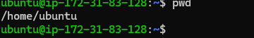

# 📁 Linux COMMAND - Side Hustle Task 1

## 👨‍💻 Author
**Ivang Silas Onda**

## 📌 Project Purpose

This project was created to fulfill the instructor's objectives for foundational Linux training. The primary goal is to demonstrate hands-on proficiency with core Linux commands used in navigating the file system, manipulating files and directories, and executing terminal-based operations.

The tasks closely follow the instructions laid out in **Side Hustle Task 1**, focusing on practical command-line skills needed by a DevOps Engineer or System Administrator.

---

## ✅ Key Objectives Covered

- ✔️ Understanding the Linux file system structure
- ✔️ Navigating directories using `pwd`, `cd`, and `ls`
- ✔️ Creating and removing files/directories (`mkdir`, `touch`, `rm`, `rmdir`)
- ✔️ Moving and copying files (`mv`, `cp`)
- ✔️ Searching for files (`find`)
- ✔️ Managing file permissions
- ✔️ Completing **Side Hustle Task 1** requirements

---

## 📂 Side Hustle Task 1 Breakdown

### 1. **Navigation Commands**

pwd        # Show current directory
cd /       # Navigate to root
cd ~       # Go to home directory
ls -la     # List all files and directories with details
2. Creating Directories and Files

mkdir -p ~/side_hustle/linux_task_1
cd ~/side_hustle/linux_task_1

touch file1.txt file2.txt file3.txt
mkdir backups logs
3. File Manipulation

mv file1.txt backups/
cp file2.txt file3.txt logs/
rm file2.txt
4. Searching for Files
find ~/side_hustle -name "*.txt"
5. Permissions

🛠️ Tools Used
Ubuntu 22.04 (WSL & Native Linux Environment)

Terminal / Bash Shell

VS Code (for documentation)

💡 Use Case
This project simulates tasks a DevOps engineer or junior system administrator might be asked to perform, such as:

Organizing configuration and backup files

Navigating server file systems via SSH

Automating cleanup and backup operations with shell scripting

🧪 Demonstration Screenshots / Logs
You can include screenshots of the terminal or session logs showing:

Directory structure

Executed commands and output

Results of find, ls -la, etc.

📁 Project Directory Structure (After Task)

~/side_hustle/linux_task_1
│
├── backups/
│   └── file1.txt
├── logs/
│   ├── file3.txt
└── file2.txt (removed)
🧾 Conclusion
This project fulfills the specific learning objectives of the Linux foundational training by demonstrating practical experience with key command-line tools, file system operations, and the successful completion of Side Hustle Task 1.

