# 🖥️ Monitor Linux Server Using Prometheus Node Exporter

This project demonstrates how to monitor a Linux server using [Prometheus](https://prometheus.io/) and [Node Exporter](https://github.com/prometheus/node_exporter). The setup allows you to collect, analyze, and visualize server metrics such as CPU usage, memory, disk I/O, and network traffic.

---

## 📦 Components

- **Prometheus** – Metrics collection and querying engine.
- **Node Exporter** – Exposes hardware and OS metrics.
- **Systemd Services** – Manage Prometheus and Node Exporter as background services.

---

## 📁 Project Structure

```
/
├── prometheus-2.52.0.linux-amd64/
│   ├── prometheus
│   ├── promtool
│   ├── prometheus.yml
│   ├── consoles/
│   └── console_libraries/
```

---

## ⚙️ Prerequisites

- Linux system (Ubuntu/Debian tested)
- wget or curl
- sudo privileges
- Internet access to download binaries

---

## 🚀 Setup Instructions

### 1. 🔧 Install Node Exporter

```bash
wget https://github.com/prometheus/node_exporter/releases/download/v1.9.1/node_exporter-1.9.1.linux-amd64.tar.gz
tar -xvzf node_exporter-1.9.1.linux-amd64.tar.gz
cd node_exporter-1.9.1.linux-amd64
sudo cp node_exporter /usr/local/bin/
```

#### Create systemd service:

```bash
sudo nano /etc/systemd/system/node_exporter.service
```

Paste:

```ini
[Unit]
Description=Node Exporter
After=network.target

[Service]
User=nobody
ExecStart=/usr/local/bin/node_exporter

[Install]
WantedBy=default.target
```

```bash
sudo systemctl daemon-reload
sudo systemctl enable --now node_exporter
```

---

### 2. 📥 Install Prometheus

```bash
wget https://github.com/prometheus/prometheus/releases/download/v2.52.0/prometheus-2.52.0.linux-amd64.tar.gz
tar -xvzf prometheus-2.52.0.linux-amd64.tar.gz
cd prometheus-2.52.0.linux-amd64
sudo cp prometheus promtool /usr/local/bin/
sudo mkdir -p /etc/prometheus /var/lib/prometheus
sudo cp -r consoles/ console_libraries/ /etc/prometheus/
sudo cp prometheus.yml /etc/prometheus/
```

#### Edit `prometheus.yml`

```yaml
global:
  scrape_interval: 15s

scrape_configs:
  - job_name: 'prometheus'
    static_configs:
      - targets: ['localhost:9090']

  - job_name: 'node_exporter'
    static_configs:
      - targets: ['localhost:9100']
```

#### Create Prometheus service:

```bash
sudo nano /etc/systemd/system/prometheus.service
```

Paste:

```ini
[Unit]
Description=Prometheus
Wants=network-online.target
After=network-online.target

[Service]
User=nobody
ExecStart=/usr/local/bin/prometheus \
  --config.file=/etc/prometheus/prometheus.yml \
  --storage.tsdb.path=/var/lib/prometheus \
  --web.console.templates=/etc/prometheus/consoles \
  --web.console.libraries=/etc/prometheus/console_libraries

[Install]
WantedBy=multi-user.target
```

```bash
sudo systemctl daemon-reload
sudo systemctl enable --now prometheus
```

---

## 🌐 Access the Monitoring UI

- Prometheus: [http://localhost:9090](http://localhost:9090)
- Node Exporter metrics: [http://localhost:9100/metrics](http://localhost:9100/metrics)

---

## 🔍 Sample Prometheus Queries (PromQL)

- **CPU Usage:**
  ```promql
  100 - (avg by (instance)(rate(node_cpu_seconds_total{mode="idle"}[1m])) * 100)
  ```

- **Memory Usage:**
  ```promql
  (1 - (node_memory_MemAvailable_bytes / node_memory_MemTotal_bytes)) * 100
  ```

- **Disk Usage:**
  ```promql
  100 - (node_filesystem_free_bytes / node_filesystem_size_bytes) * 100
  ```

- **Network Throughput:**
  ```promql
  rate(node_network_receive_bytes_total[1m])
  ```

---

## 📈 Next Steps

- 🔹 Integrate with **Grafana** for advanced dashboards.
- 🔹 Set up **Alertmanager** for automatic notifications.
- 🔹 Use **Docker** or **Terraform** for production deployment.

---

## 📸 Screenshot

> Prometheus Targets Page  
> 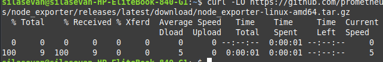
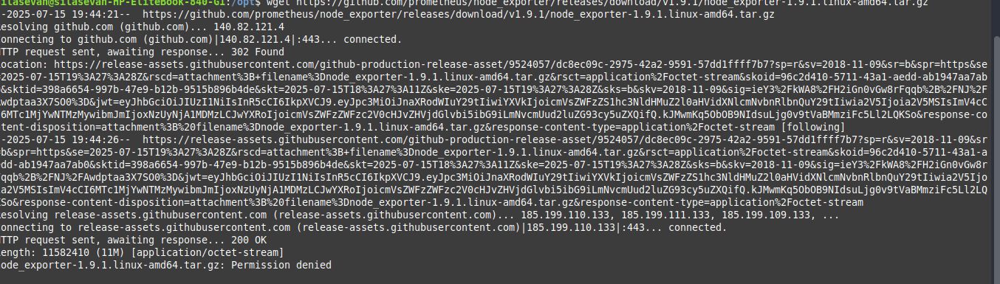
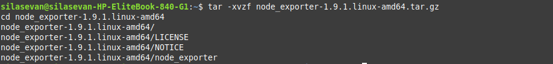

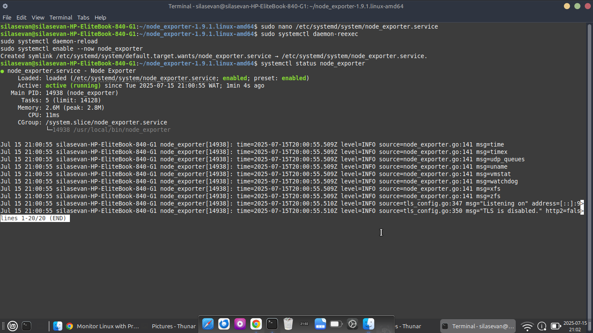
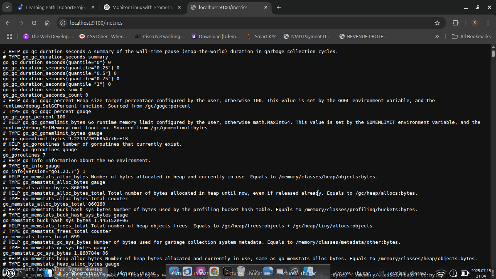
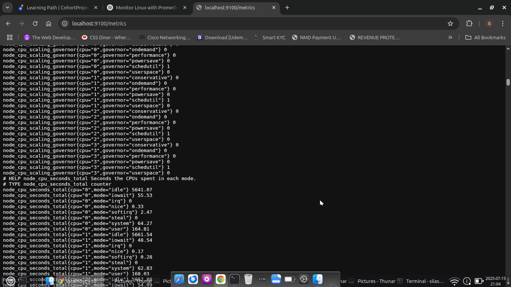
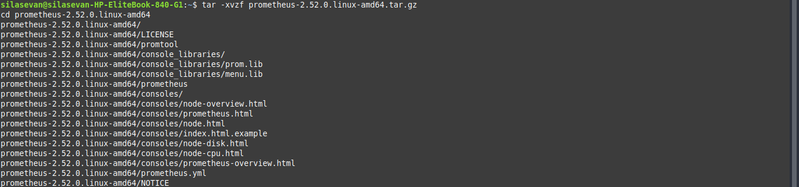
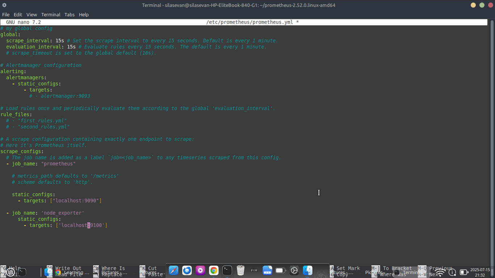
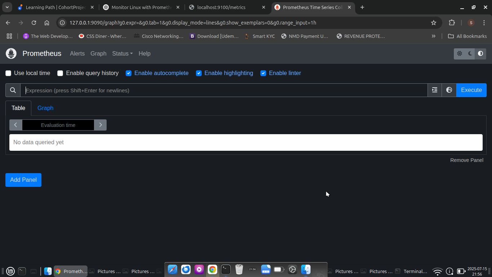
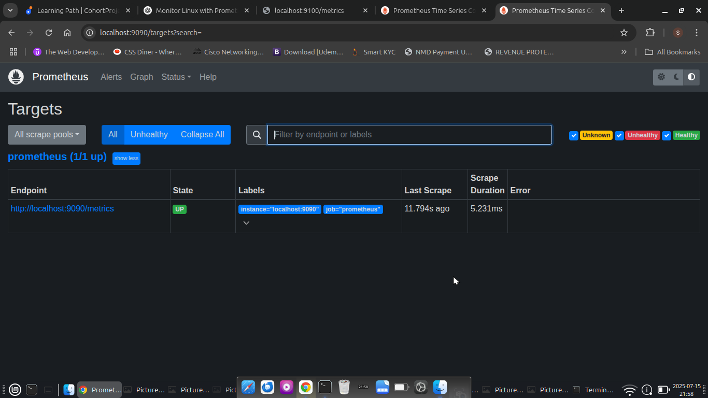
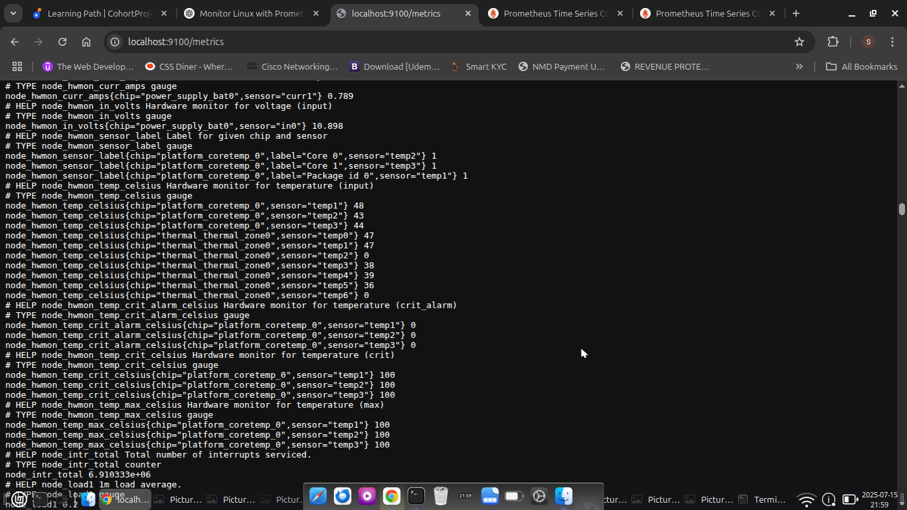
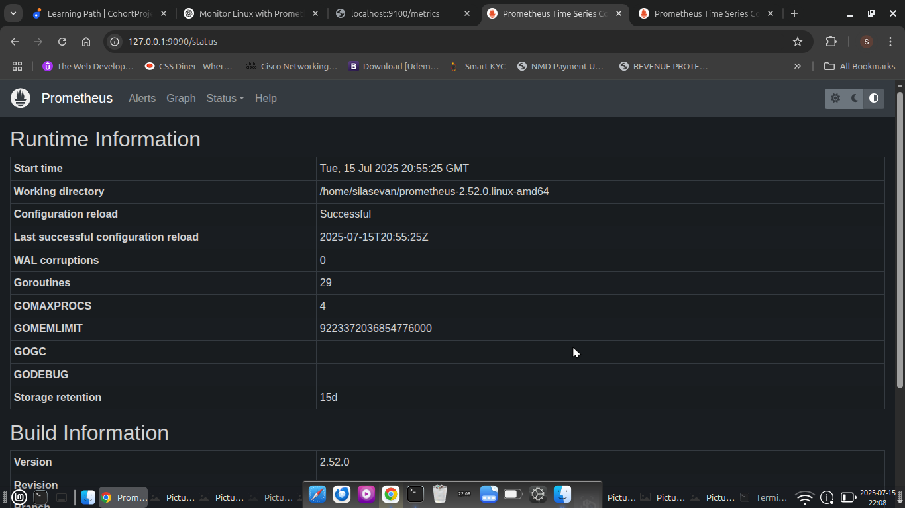

---

## 🧑‍💻 Author

Silas Ivang  


---

## 📜 License

This project is licensed under the MIT License.