# Flask Docker Web App Deployment on AWS with Terraform, ECR, and ECS (Fargate)

This documentation outlines the end-to-end deployment of a Flask web application using Docker, Terraform, and AWS services such as ECR and ECS (Fargate). The goal is to containerize the app, push it to AWS ECR, and deploy it to a scalable ECS Fargate service.

---

## Table of Contents

* [Overview](#overview)
* [Project Structure](#project-structure)
* [Prerequisites](#prerequisites)
* [Step-by-Step Deployment](#step-by-step-deployment)

  * [1. Build the Flask App](#1-build-the-flask-app)
  * [2. Create Docker Image](#2-create-docker-image)
  * [3. Create Terraform Modules](#3-create-terraform-modules)
  * [4. Build Infrastructure with Terraform](#4-build-infrastructure-with-terraform)
  * [5. Authenticate and Push Image to ECR](#5-authenticate-and-push-image-to-ecr)
  * [6. Access the Flask App](#6-access-the-flask-app)
  * [7. Clean Up](#7-clean-up)
* [Screenshots](#screenshots)
* [Future Improvements](#future-improvements)
* [Author](#author)
* [License](#license)

---

## Overview

This project demonstrates how to:

* Write a simple Flask app.
* Containerize it using Docker.
* Deploy it to Amazon ECS using Fargate.
* Use Terraform to automate the infrastructure setup.
* Use ECR to store and manage Docker images.

---

## Project Structure

```
flask-terraform-ecs/
├── docker/
│   ├── Dockerfile
│   └── app/
│       ├── run.py
│       └── app/
│           ├── __init__.py
│           ├── routes.py
│           └── templates/
│               └── index.html
├── terraform.tfvars
├── variables.tf
├── outputs.tf
├── providers.tf
├── main.tf
├── modules/
│   ├── ecr/
│   ├── ecs/
│   └── network/
└── screenshots/
```

---

## Prerequisites

Ensure the following tools are installed:

* AWS CLI
* Terraform (>= 1.3)
* Docker
* AWS credentials configured using `aws configure`

---

## Step-by-Step Deployment

### 1. Build the Flask App

Sample Flask code resides in `docker/app/` and includes `run.py`, `__init__.py`, `routes.py`, and an HTML form in `templates/index.html`.

### 2. Create Docker Image

**Dockerfile:**

```dockerfile
FROM python:3.11-slim
WORKDIR /app
COPY app/ /app
RUN pip install flask
EXPOSE 5000
CMD ["python", "run.py"]
```

Build the image:

```bash
docker build -t flask-docker-app ./docker
```

Test it locally:

```bash
docker run -p 5000:5000 flask-docker-app
```

Access via: [http://localhost:5000](http://localhost:5000)

### 3. Create Terraform Modules

Create reusable modules for:

* VPC and Subnets (modules/network)
* ECR (modules/ecr)
* ECS Fargate setup (modules/ecs)

Each module should have:

* `main.tf`
* `variables.tf`
* `outputs.tf`

### 4. Build Infrastructure with Terraform

1. Define variables in `terraform.tfvars`:

```hcl
azs = ["us-east-1a", "us-east-1b"]
public_subnet_cidrs = ["10.0.1.0/24", "10.0.2.0/24"]
```

2. Initialize and apply Terraform:

```bash
terraform init
terraform apply
```

3. IAM role `ecsTaskExecutionRole` is created with policy `AmazonECSTaskExecutionRolePolicy`.

### 5. Authenticate and Push Image to ECR

```bash
aws ecr get-login-password --region us-east-1 | \
docker login --username AWS --password-stdin <account-id>.dkr.ecr.us-east-1.amazonaws.com

docker tag flask-docker-app:latest <account-id>.dkr.ecr.us-east-1.amazonaws.com/flask-docker-app:latest

docker push <account-id>.dkr.ecr.us-east-1.amazonaws.com/flask-docker-app:latest
```

### 6. Access the Flask App

1. Go to ECS Console → Clusters → Tasks
2. Open the Task → Networking → ENI → Public IP
3. Access via browser:

```
http://<public-ip>:5000
```

### 7. Clean Up

```bash
terraform destroy
```

---

## Screenshots

Save these in `screenshots/` directory:

1. Flask App in Browser
   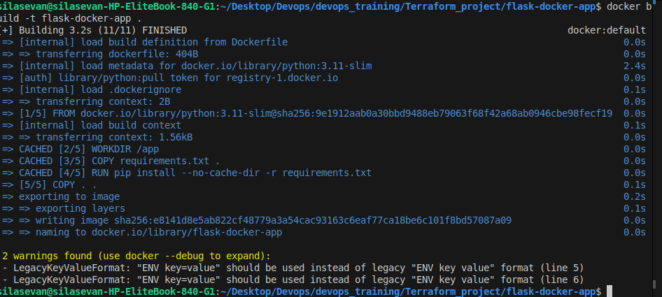

2. ECS Task Details
   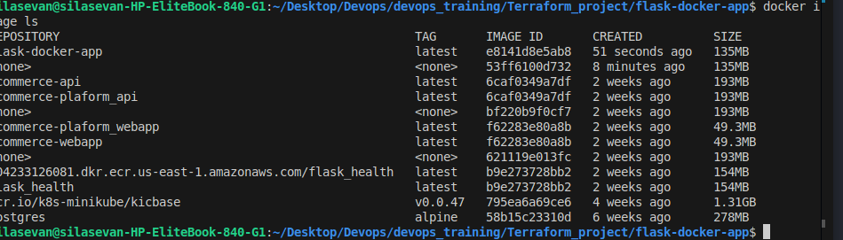

3. ECR Repository
   

4. Terraform Apply Output
   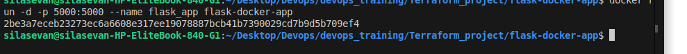
   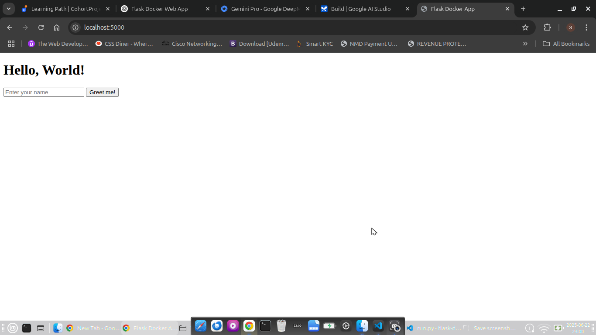

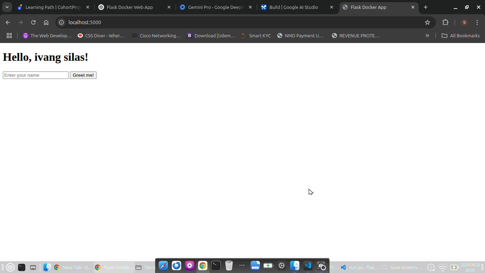

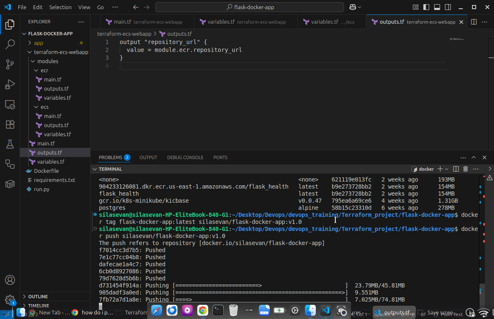

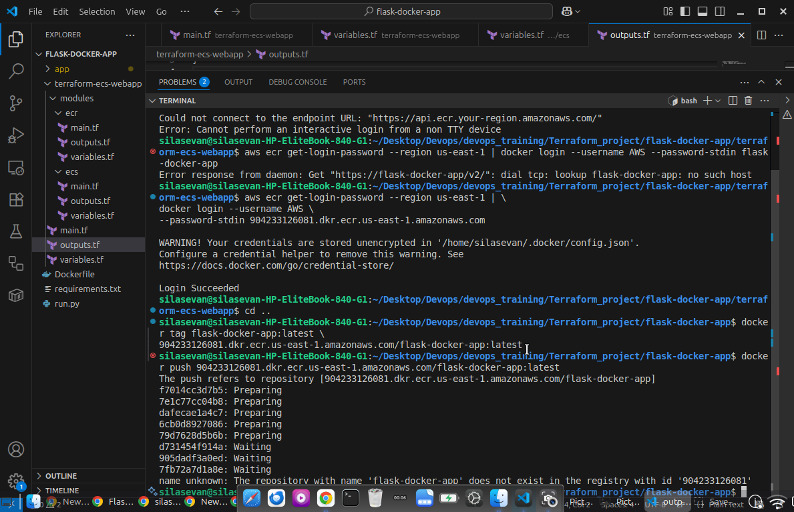

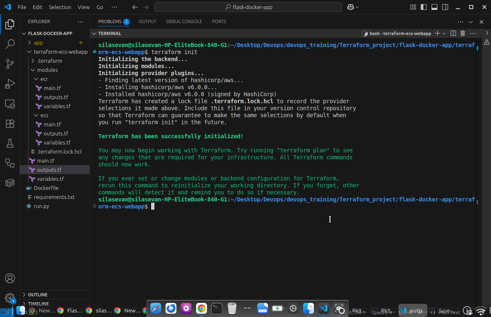


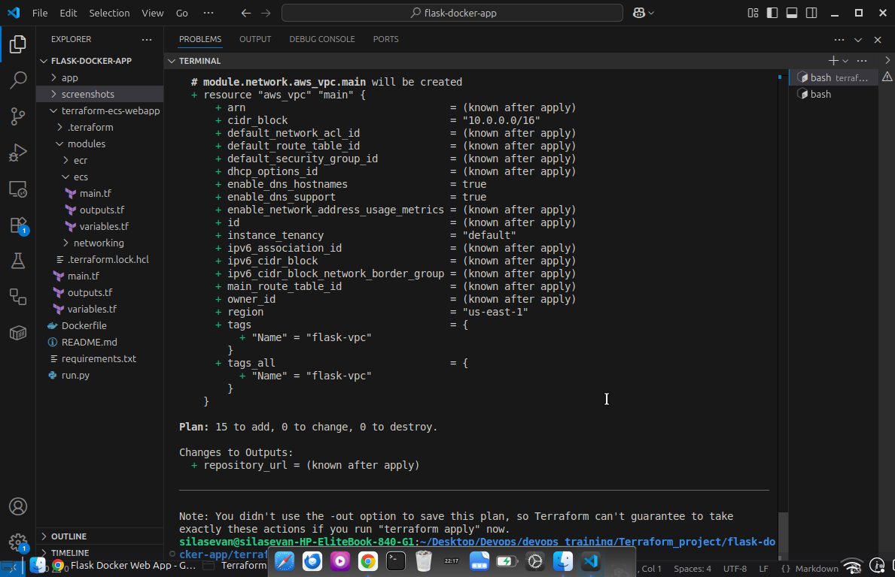

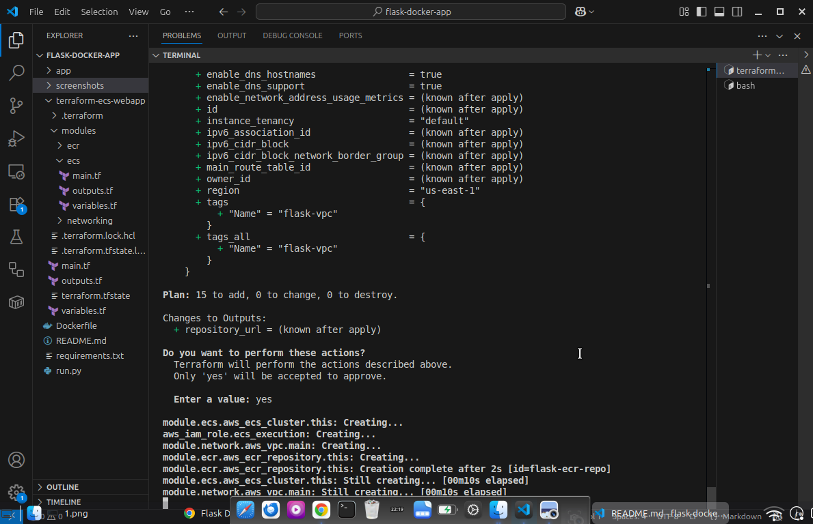

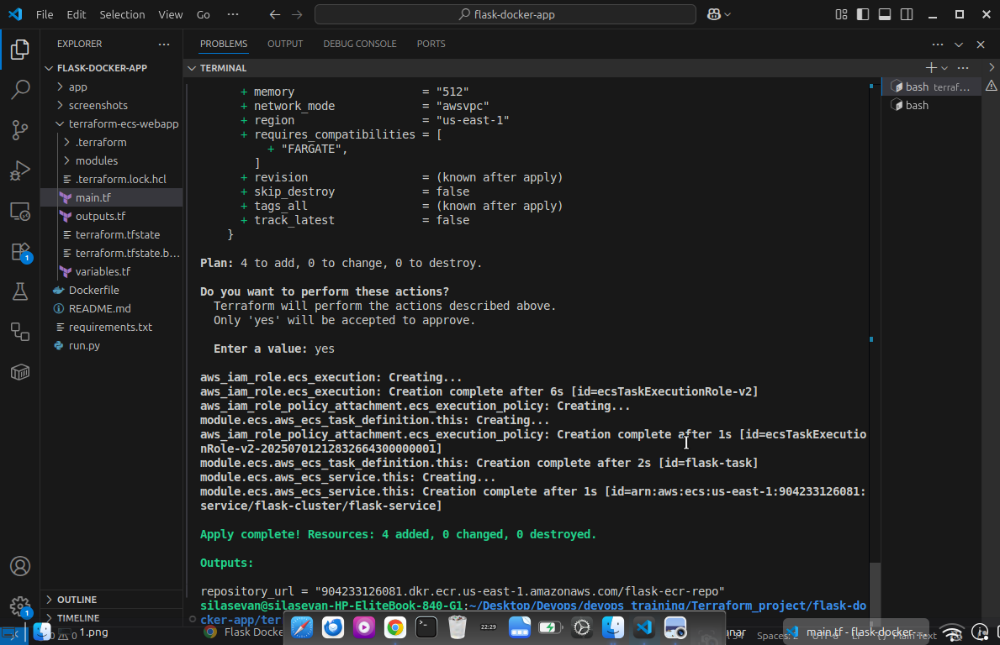

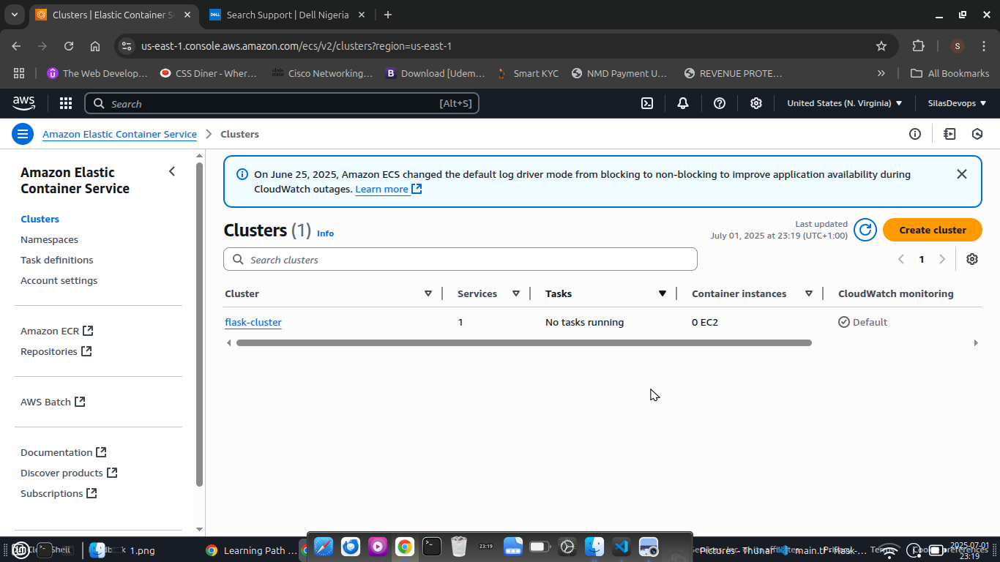

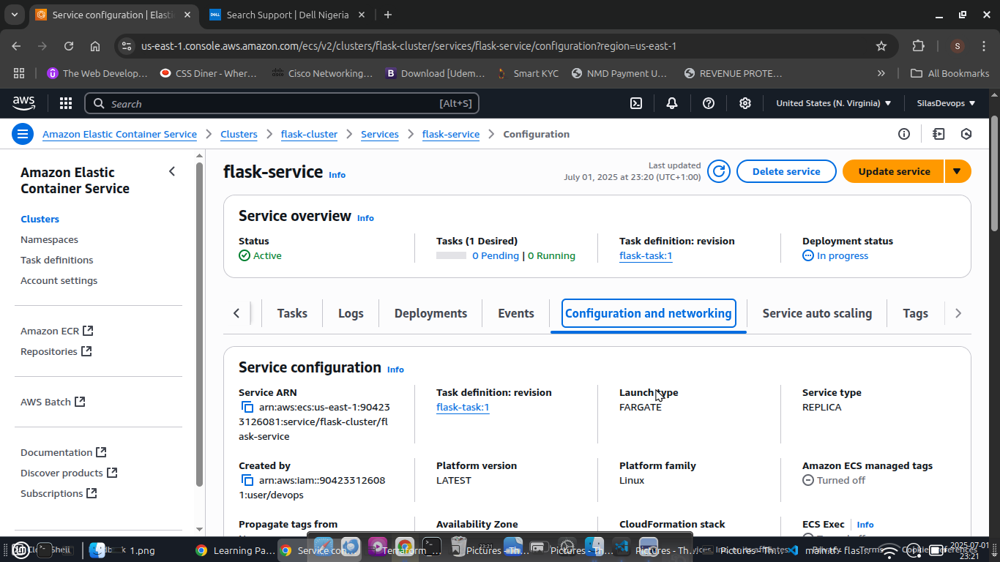

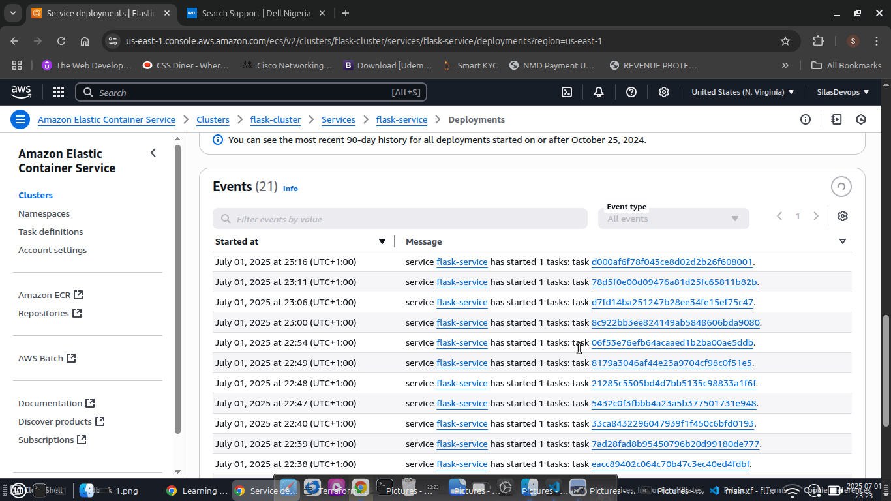
[Terraform](screenshots/17.png)


---

## Future Improvements

* Add Application Load Balancer and HTTPS via ACM
* Integrate with GitHub Actions for CI/CD
* Register custom domain with Route 53
* Add backend database (e.g., RDS)

---

## Author

**Silas Evan Ivang**
DevOps Engineer | Cloud Solutions | Infrastructure Automation

---

## License

This project is licensed under the MIT License.
