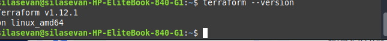

# 📄 Terraform EC2 and AMI Automation – Mini Project

## 🧾 Project Overview

This mini project demonstrates how to use **Terraform** to:

1. Provision an **Amazon EC2 instance**
2. Optionally configure the instance
3. Create an **Amazon Machine Image (AMI)** from the instance
4. (Optionally) Destroy the EC2 instance after AMI creation

This is useful for infrastructure automation, creating reusable server images, and setting up base configurations for deployments.

---

## 🛠️ Prerequisites

Before running this project, ensure you have the following:

- An **AWS account**
- An **EC2 Key Pair** created in AWS
- **Terraform installed** (`terraform -v`)
- **AWS CLI configured** (`aws configure`)

---

## 📁 Project Structure
ec2-ami-demo/
├── main.tf
└── README.md
provider "aws" {
  region = "us-east-1"
}

# Create EC2 Instance
resource "aws_instance" "my_ec2" {
  ami           = "ami-0c02fb55956c7d316" # Ubuntu 20.04 LTS AMI
  instance_type = "t2.micro"
  key_name      = "your-key-name"         # Replace with your actual key pair name

  tags = {
    Name = "MyFirstEC2"
  }
}

# Create AMI from the EC2 instance
resource "aws_ami_from_instance" "my_ami" {
  name               = "MyCustomAMI-${timestamp()}"
  source_instance_id = aws_instance.my_ec2.id
}

🧪 ## How to Use
Step 1: Create the Project Directory
mkdir ec2-ami
cd ec2-ami-demo
Step 2: Add the main.tf File
Copy and paste the Terraform code above into a file called main.tf.

Step 3: Initialize Terraform
terraform init
Initializes Terraform and downloads necessary provider plugins.

Step 4: Review the Plan
terraform plan
This command shows you what Terraform is going to do without actually doing it.

Step 5: Apply the Configuration
terraform apply
Terraform will:

Create the EC2 instance

Automatically create an AMI from that instance

You will be prompted to confirm by typing yes.

Step 6: Verify in AWS Console
Go to the EC2 Dashboard

Under Instances, you will see the running instance

Under AMIs, you will see your custom image

 Step 7: Destroy the Resources
terraform destroy
This removes the EC2 instance but leaves the AMI in place.

# Screenshots

