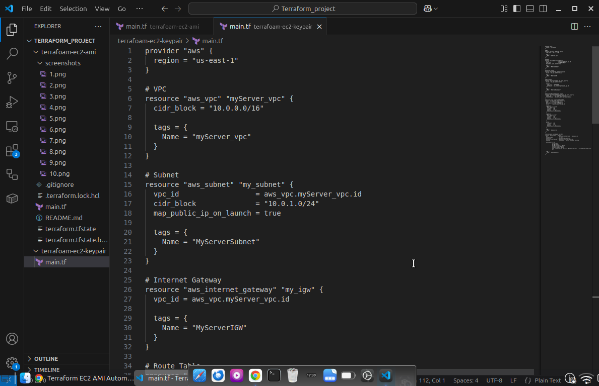
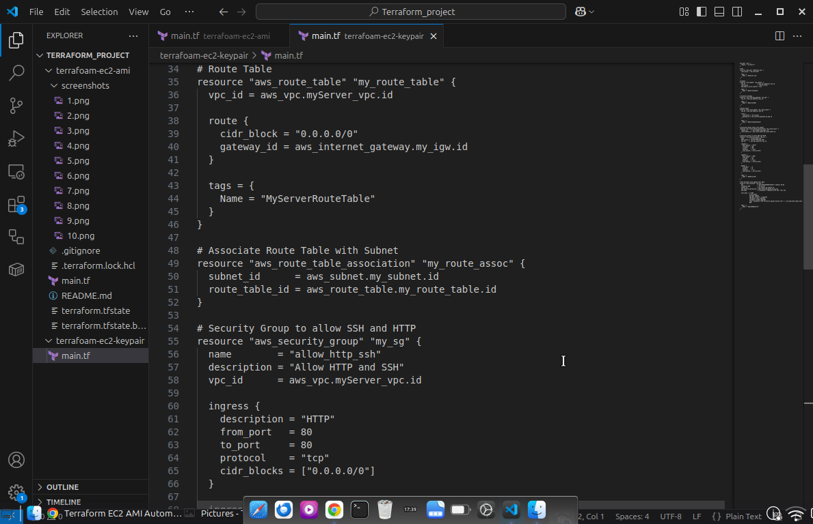
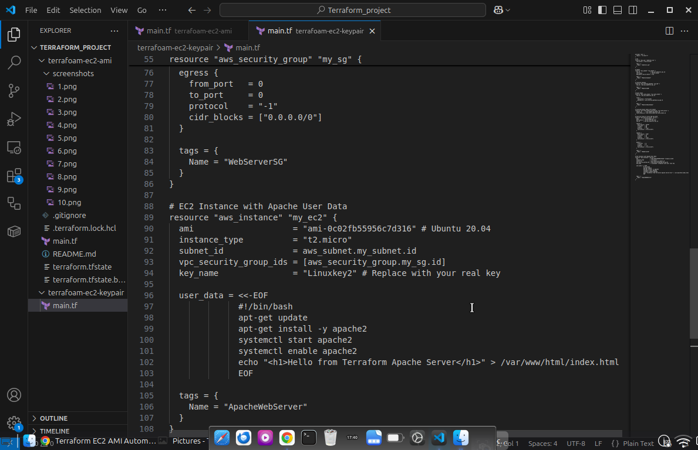
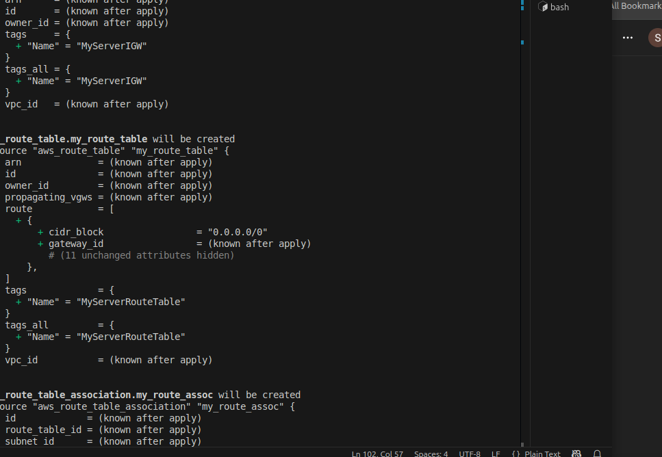
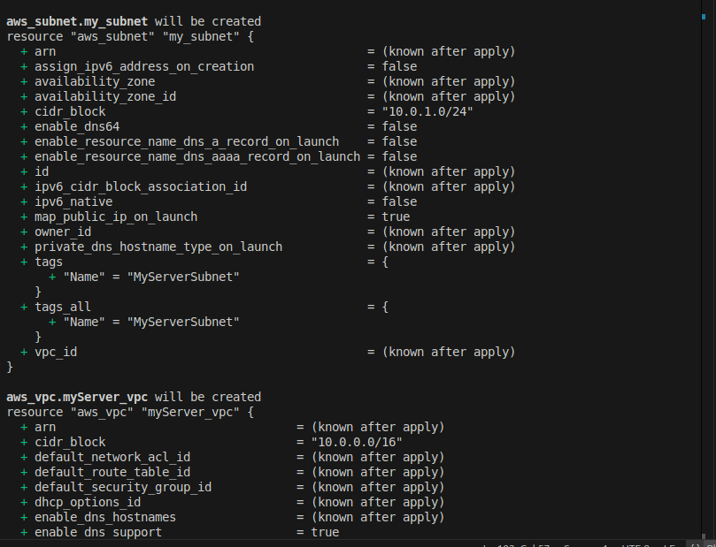
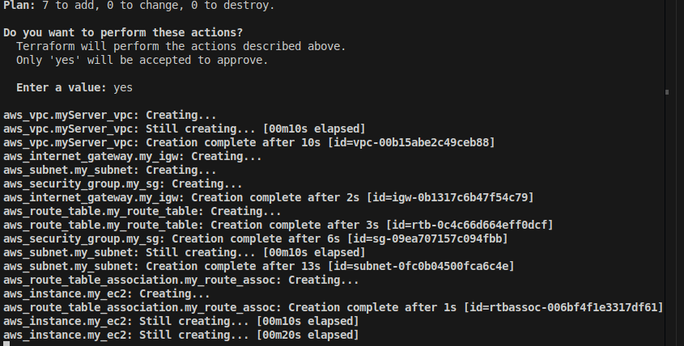
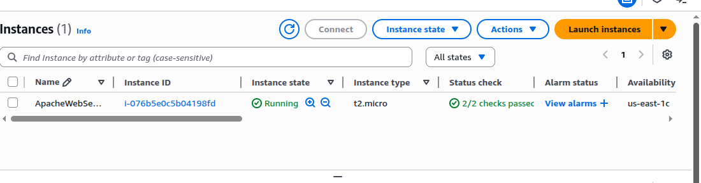
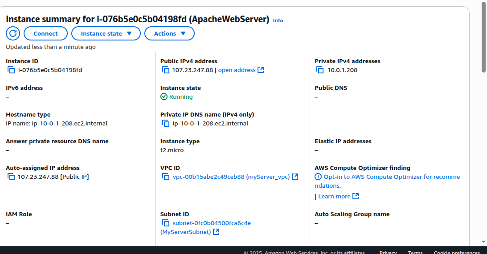
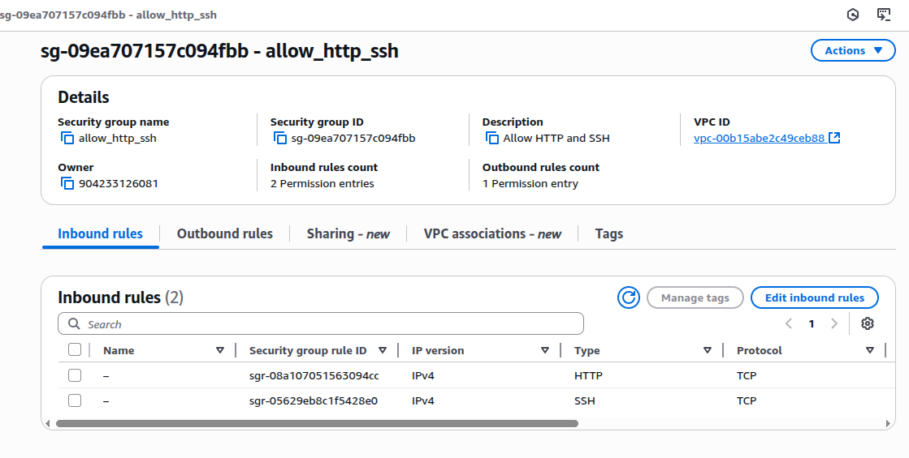
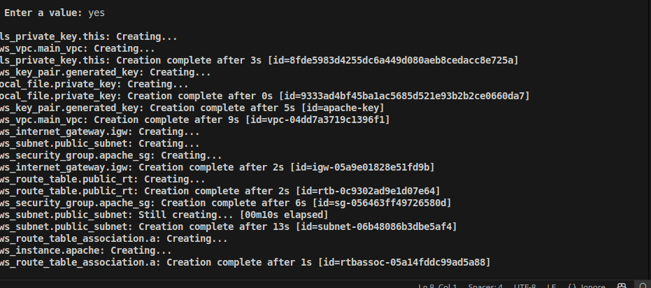

# 🚀 Terraform Apache EC2 Setup

This project provisions an **Apache web server** on an **EC2 instance** in AWS using Terraform. It includes:

* VPC with public subnet
* Internet Gateway and routing
* Security group for SSH and HTTP
* Auto-generated EC2 key pair
* EC2 instance with Apache installed via user data

---

## 🧰 Prerequisites

Ensure you have the following installed locally:

* [Terraform](https://developer.hashicorp.com/terraform/downloads) (v1.2+)
* [AWS CLI](https://docs.aws.amazon.com/cli/latest/userguide/install-cliv2.html)
* AWS account and credentials configured (`~/.aws/credentials`)

---

## 📁 Project Structure

```
terraform-apache-server/
│
├── main.tf            # Contains all AWS resources
├── outputs.tf         # Outputs public IP of the EC2 instance
├── versions.tf        # Specifies provider versions
├── .gitignore         # Prevents committing state files and private key
└── apache-key.pem     # Generated private key for SSH (auto-created)
```

---

## ⚙️ How It Works

### Resources Created:

* **VPC** — with a CIDR of `10.0.0.0/16`
* **Public Subnet** — `10.0.1.0/24` with public IP mapping
* **Internet Gateway** — enables outbound access
* **Route Table** — directs traffic to internet
* **Security Group** — allows inbound HTTP (port 80) and SSH (port 22)
* **Key Pair** — auto-generated using TLS provider
* **EC2 Instance** — Ubuntu 20.04, with Apache installed and enabled

---

## 🚀 Usage

### 1. Clone the repo (or copy the files)

```bash
git clone https://github.com/<your-username>/terraform-apache-server.git
cd terraform-apache-server
```

### 2. Initialize Terraform

```bash
terraform init
```

### 3. Deploy the Infrastructure

```bash
terraform apply
```

Type `yes` when prompted.

Terraform will:

* Generate `apache-key.pem`
* Provision networking components
* Launch an EC2 instance
* Output the public IP

---

## 🔑 Access the EC2 Instance

### 1. Make the key readable

```bash
chmod 400 apache-key.pem
```

### 2. SSH into the EC2 instance

```bash
ssh -i apache-key.pem ubuntu@<public_ip>
```

> Replace `<public_ip>` with the output from `terraform apply`.

---

## 🌐 Access the Apache Web Server

Open your browser and visit:

```
http://<public_ip>
```

You should see:

```
Apache Server Deployed with Terraform!
```

---

## 🧹 Teardown (Cleanup)

To destroy all resources:

```bash
terraform destroy
```

Type `yes` to confirm.

---

## 📝 Notes

* The private key (`apache-key.pem`) is generated locally and should **not be shared**.
* Ensure port 22 is open in your network/firewall to allow SSH.

---
## screenshot











## 📌 Author

Silas Evan — [@silasevan](https://github.com/silasevan)

---

## 📄 License

This project is licensed under the MIT License.
