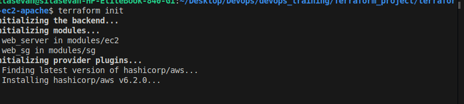
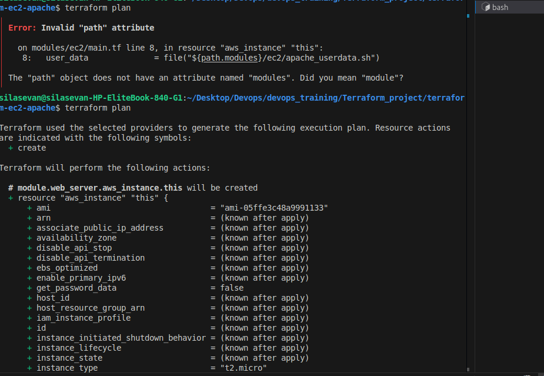
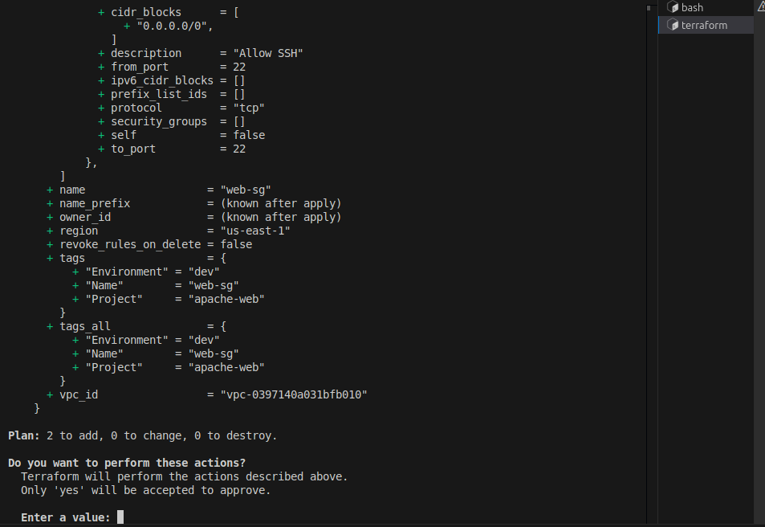
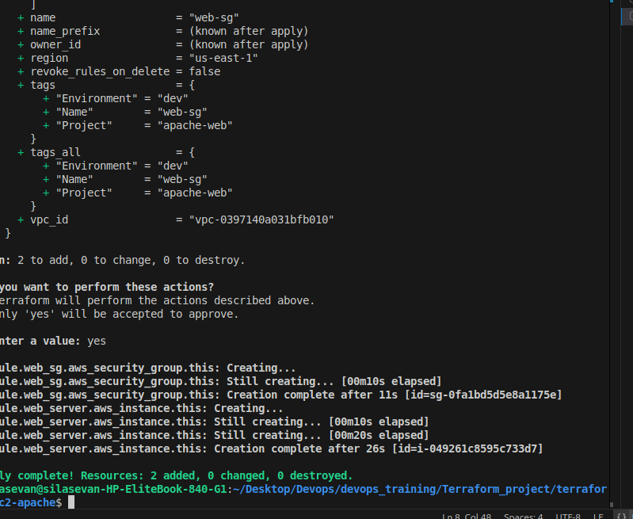
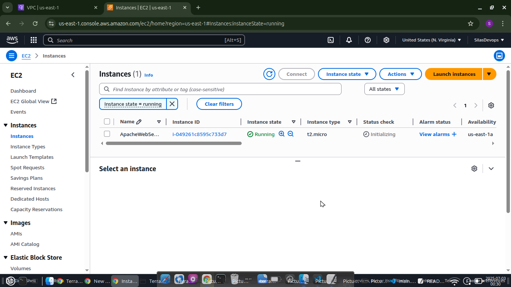
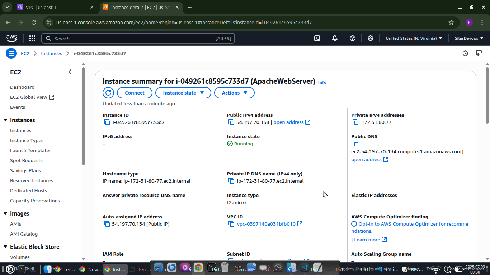
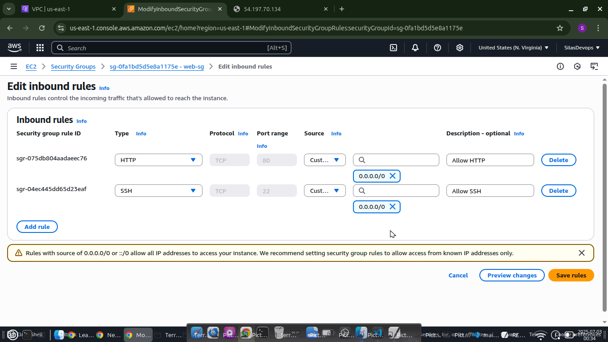

# 🚀 Terraform Project: EC2 Instance with Apache & Security Group

This project provisions an **EC2 instance** running **Apache2**, secured by a **Security Group**, using reusable Terraform modules.

---

## 📁 Project Structure

```
project-root/
├── main.tf                     # Root configuration file
├── apache_userdata.sh          # User data script to install Apache
├── terraform-ec2-module/       # EC2 instance module
│   ├── main.tf
│   ├── variables.tf
│   └── outputs.tf
├── terraform-sg-module/        # Security group module
│   ├── main.tf
│   ├── variables.tf
│   └── outputs.tf
```

---

## 🧩 Modules

### 🔧 terraform-ec2-module

Reusable EC2 module that:
- Accepts AMI, instance type, key name, subnet, and security group
- Attaches a `user_data` script for Apache setup
- Tags the instance

### 🔐 terraform-sg-module

Reusable Security Group module that:
- Allows HTTP (80) and SSH (22) inbound
- Allows all outbound traffic
- Accepts custom CIDR blocks

---

## 🖥️ User Data Script

### `apache_userdata.sh`

```bash
#!/bin/bash
sudo apt update -y
sudo apt install apache2 -y
sudo systemctl start apache2
sudo systemctl enable apache2
echo "<h1>Apache is installed and running!</h1>" | sudo tee /var/www/html/index.html
```

Make it executable:
```bash
chmod +x apache_userdata.sh
```

---

## 📦 main.tf (Root Configuration)

```hcl
provider "aws" {
  region = "us-east-1"
}

module "web_sg" {
  source             = "./terraform-sg-module"
  sg_name            = "web-sg"
  vpc_id             = "vpc-xxxxxxxx"
  allowed_ssh_cidrs  = ["0.0.0.0/0"]
  allowed_http_cidrs = ["0.0.0.0/0"]
  tags = {
    Environment = "dev"
    Project     = "apache-web"
  }
}

module "web_server" {
  source             = "./terraform-ec2-module"
  ami_id             = "ami-0c55b159cbfafe1f0"
  instance_type      = "t2.micro"
  key_name           = "my-key-pair"
  subnet_id          = "subnet-xxxxxxxx"
  security_group_ids = [module.web_sg.security_group_id]
  instance_name      = "ApacheWebServer"
  tags = {
    Environment = "dev"
    Project     = "apache-web"
  }
}
```

---

## ⚙️ How to Use

1. **Initialize Terraform**
   ```bash
   terraform init
   ```

2. **Validate the Configuration**
   ```bash
   terraform validate
   ```

3. **Apply the Configuration**
   ```bash
   terraform apply
   ```

4. **Access the EC2 Instance**
   - Use the public IP output from Terraform.
   - Open your browser to `http://<public-ip>` to view Apache default page.

---

## 🧼 Clean Up

To destroy all resources:
```bash
terraform destroy
```

---

## ✅ Prerequisites

- AWS CLI configured (`aws configure`)
- Terraform installed
- Valid AWS Key Pair created in your region
- Replace placeholders (`vpc-xxxxxx`, `subnet-xxxxxx`, etc.) with actual values

---

## 📸 Sample Screenshot










---

## 📚 References

- [Terraform AWS Provider](https://registry.terraform.io/providers/hashicorp/aws/latest/docs)
- [Terraform Modules Documentation](https://developer.hashicorp.com/terraform/language/modules)

---

## 🧠 Author

**Ivang Silas Onda**
