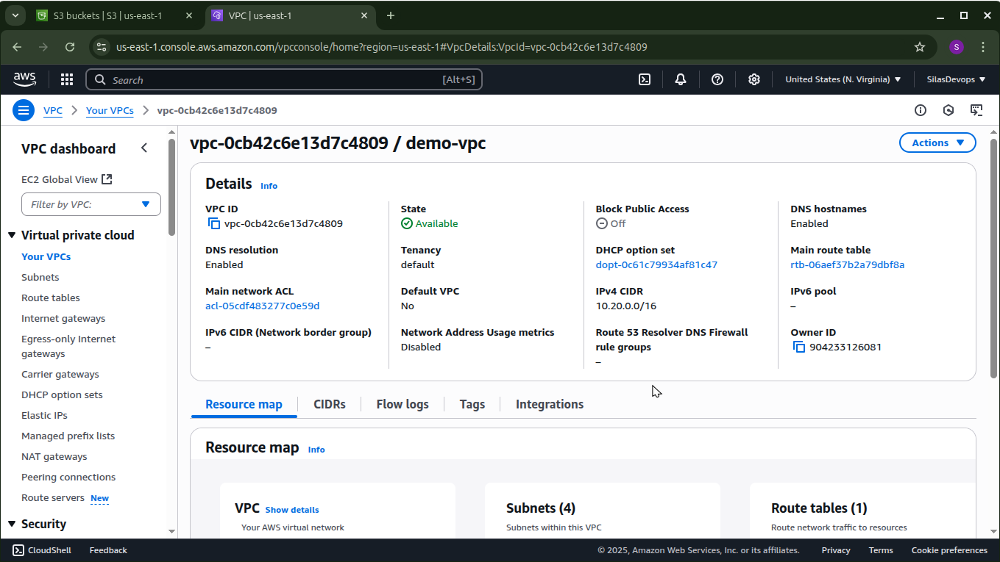

# Terraform AWS Infrastructure: VPC + S3 Bucket

This Terraform project creates a custom Virtual Private Cloud (VPC) and an S3 bucket using modular architecture.

## 📦 Features

### ✅ VPC
- Customizable CIDR block
- Public and private subnets across Availability Zones
- Internet Gateway
- Tagging support

### ✅ S3 Bucket
- Custom bucket name
- Versioning (optional)
- Server-side encryption (AES-256)
- ACL support (e.g. `private`, `public-read`, etc.)
- Force destroy option
- Public access blocked by default

---

## 📁 Project ScreenShots

