# Terraform WordPress Infrastructure Deployment

This project provisions a **modular, scalable, and secure WordPress infrastructure on AWS** using **Terraform**. It follows infrastructure-as-code best practices and uses modules for organizing components such as networking, compute, database, and storage.

---

## 📁 Project Structure

```
terraform-wordpress/
├── main.tf
├── variables.tf
├── terraform.tfvars
├── outputs.tf
└── modules/
    ├── network/
    ├── compute/
    ├── rds/
    └── efs/
```

---

## 🔧 Features

- VPC with public and private subnets across 2 Availability Zones
- NAT Gateway for private subnet outbound access
- EC2 Auto Scaling Group with Application Load Balancer
- Amazon RDS (MySQL) for database backend
- Amazon EFS for shared WordPress storage
- Security groups for EC2 and RDS isolation

---

## ☁️ AWS Resources Created

| Component      | AWS Service        |
|----------------|---------------------|
| Network        | VPC, Subnets, NAT GW|
| Compute        | EC2, ASG, ALB       |
| Storage        | Amazon EFS          |
| Database       | Amazon RDS (MySQL)  |
| Security       | Security Groups     |

---

## 📄 Requirements

- Terraform >= 1.0
- AWS CLI configured with valid credentials
- Valid EC2 key pair in the target AWS region
- A valid AMI ID for your region (e.g. Amazon Linux 2)

---

## 📓 Example terraform.tfvars

```hcl
vpc_cidr              = "10.0.0.0/16"

public_subnet_cidr_1  = "10.0.11.0/24"
public_subnet_cidr_2  = "10.0.12.0/24"
private_subnet_cidr_1 = "10.0.21.0/24"
private_subnet_cidr_2 = "10.0.22.0/24"

availability_zone_1   = "us-east-1a"
availability_zone_2   = "us-east-1b"

db_name               = "wordpress_db"
db_username           = "admin"
db_password           = "supersecurepassword"

ami_id                = "ami-0c02fb55956c7d316"
instance_type         = "t2.micro"
key_name              = "your-keypair-name"
```

---

## ⚙️ Usage

### 1. Initialize Terraform
```bash
terraform init
```

### 2. Validate Configuration
```bash
terraform validate
```

### 3. Plan Infrastructure
```bash
terraform plan
```

### 4. Apply Infrastructure
```bash
terraform apply
```

---

## 🛃 Clean Up

```bash
terraform destroy
```
This will remove all infrastructure created by Terraform.

---

## 🧠 Tips

- Always use unique CIDR ranges for your subnets.
- Make sure AMI IDs and key names match your region/account.
- Ensure the RDS subnet group spans **two AZs**.

---

## 🖼️ Screenshots

> Replace the below placeholders with your screenshots after a successful deployment.

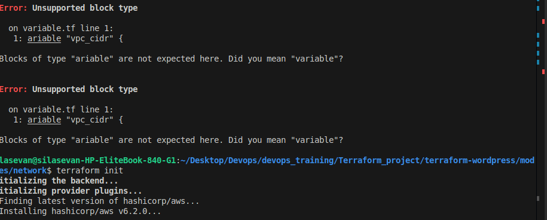
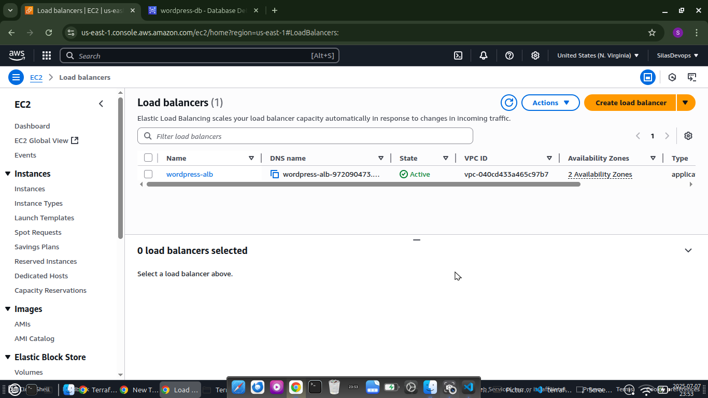
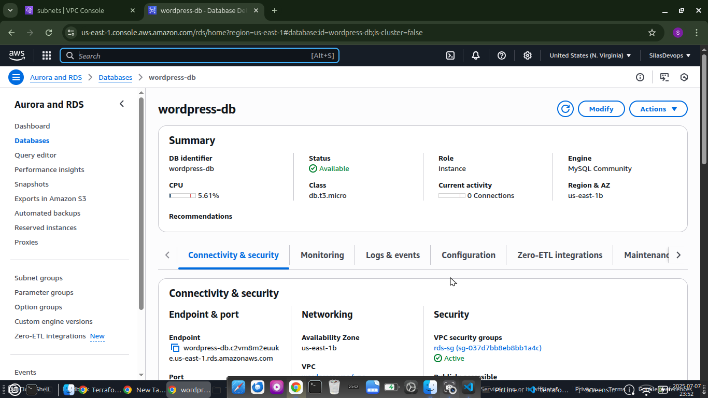
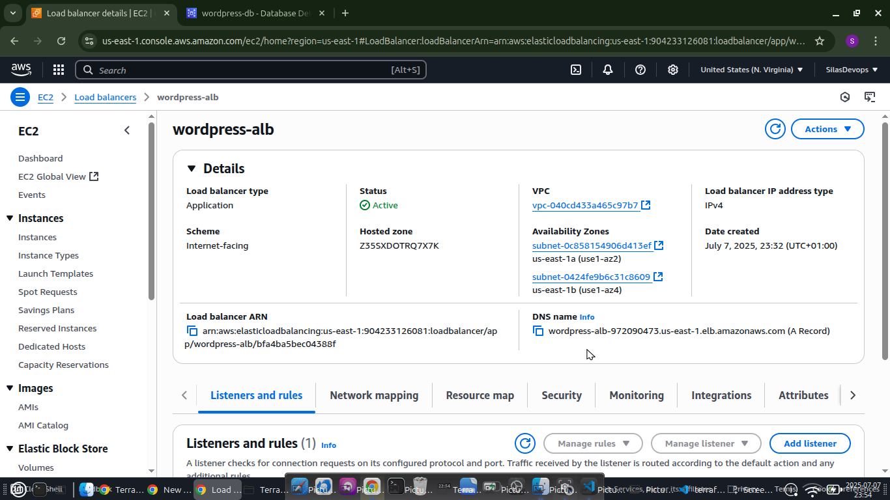
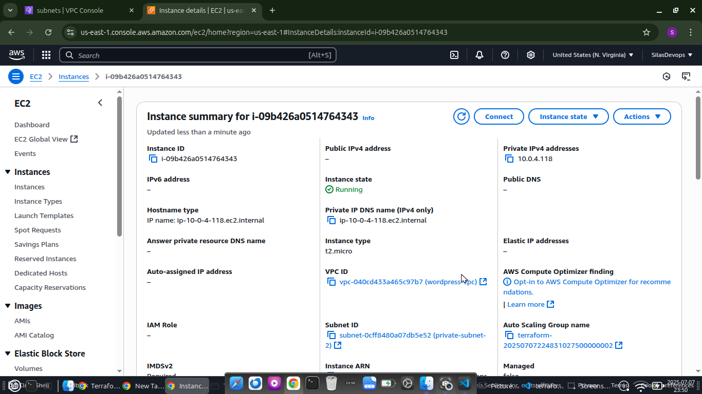
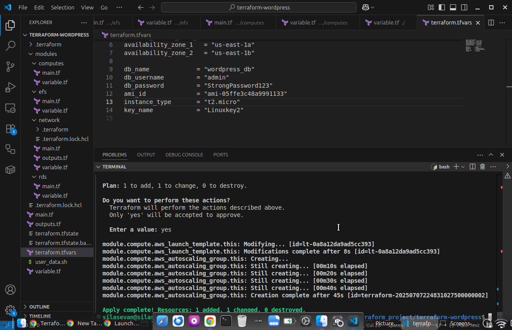
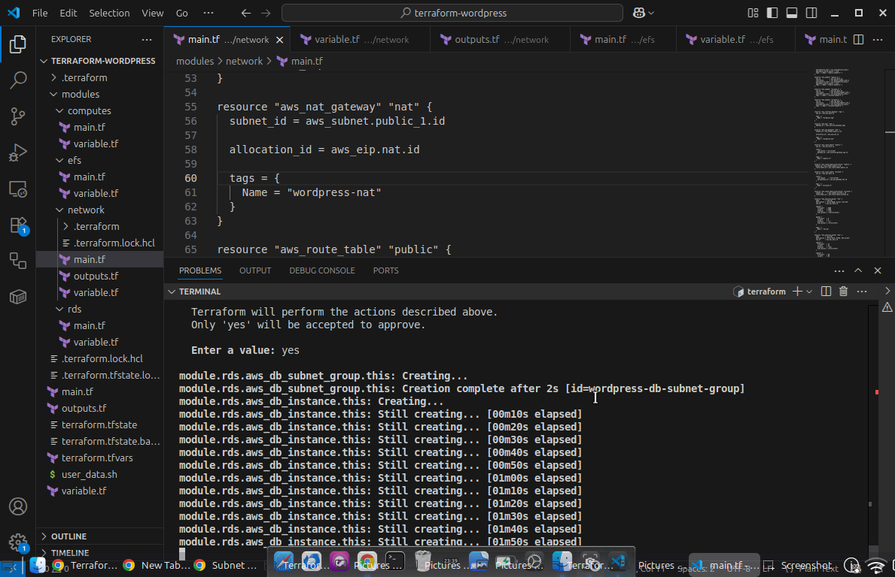
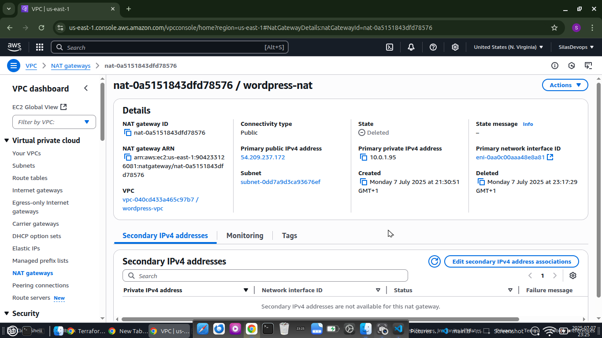
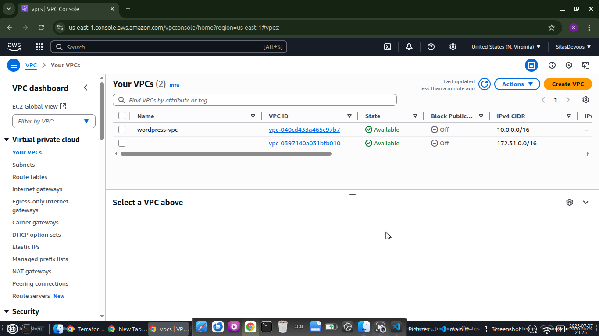
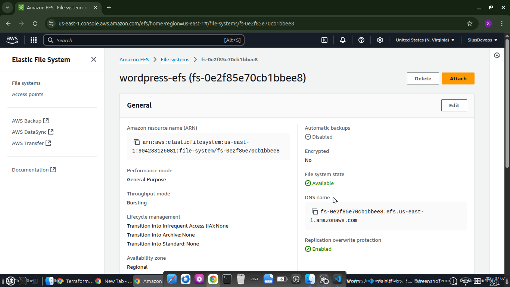
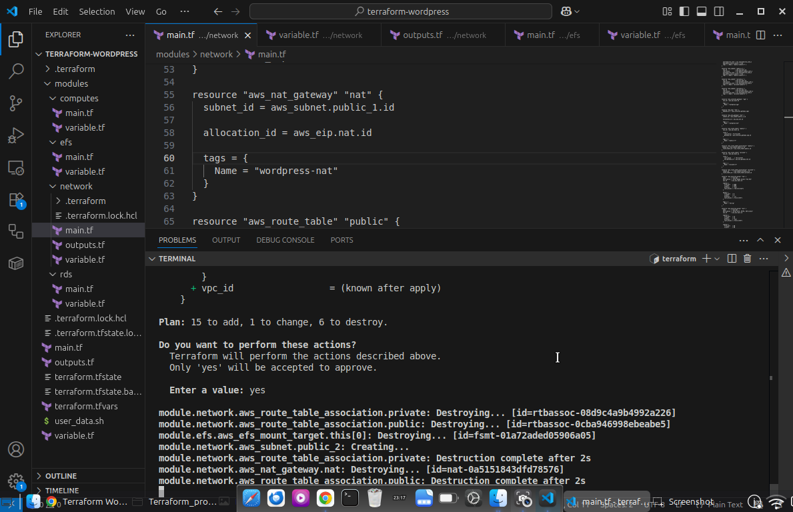
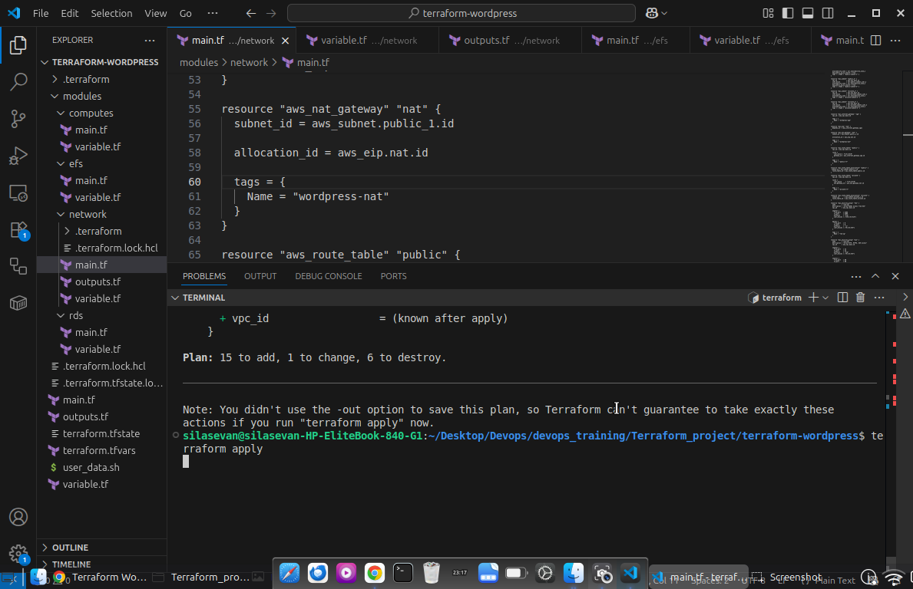

---

## 👨‍💼 Author

**Silas Evan**  
DevOps Engineer | Cloud Infrastructure Enthusiast

---

## 📄 License

MIT License – Free to use and modify.
