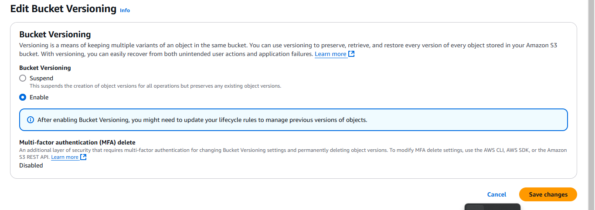

# 🪣 AWS S3 Bucket Project - `siltechdevbucket`

## 📌 Project Overview

This mini-project demonstrates how I created and managed an Amazon S3 bucket named `siltechdevbucket` using the AWS Management Console. The objective was to explore essential features of Amazon S3 such as versioning, bucket policies, lifecycle rules, and object uploads.

---

## 🔧 Steps Taken

### 1. **Created the S3 Bucket**
- Opened the **AWS S3 Console**
- Clicked on **Create bucket**
- Entered the bucket name: `siltechdevbucket`
- Selected preferred AWS region (e.g., `us-east-1`)
- Kept default settings (Block all public access enabled)
- Clicked **Create bucket**


---

### 2. **Enabled Versioning**
- Opened the bucket and clicked on the **Properties** tab
- Scrolled to **Bucket Versioning**
- Clicked **Edit** and enabled **Versioning**
- Saved changes



---

### 3. **Uploaded `hello.txt`**
- Created a simple text file named `hello.txt`
- Opened the bucket and clicked on **Upload**
- Selected the file and uploaded it successfully


---

### 4. **Created Bucket Policy**
- Navigated to the **Permissions** tab of the bucket
- Scrolled to **Bucket Policy**
- Clicked **Edit** and added the following policy to allow public read access to `hello.txt`:


```json
{
  "Version": "2012-10-17",
  "Statement": [
    {
      "Sid": "PublicReadGetObject",
      "Effect": "Allow",
      "Principal": "*",
      "Action": "s3:GetObject",
      "Resource": "arn:aws:s3:::siltechdevbucket/hello.txt"
    }
  ]
}

---

----
### 5. Created Lifecycle Policy
Clicked on the Management tab in the bucket

Clicked Create lifecycle rule

Named the rule (e.g., GlacierTransitionRule)

Applied rule to all objects

Added a transition action for non-current versions

Set the rule to transition non-current versions to Glacier after 30 days


---


📘 What I Learned
How to create and configure an S3 bucket using the AWS Management Console

The benefits of Versioning to preserve, retrieve, and restore every version of an object stored in the bucket

How to configure a Bucket Policy to manage access control

How to implement Lifecycle Rules for efficient storage cost management

Improved my familiarity with the AWS S3 service and its management interfaces

project-folder/
├── README.md
├── hello.txt
└── screenshots/
    ├── bucket_created.png
    ├── versioning_enabled.png
    ├── hello_txt_uploaded.png
    ├── bucket_policy.png
    └── lifecycle_policy.png


✅ Conclusion
This mini-project provided hands-on experience with setting up and managing an AWS S3 bucket. It helped me understand the core features of S3 and how they contribute to building secure, scalable, and cost-effective cloud storage solutions.