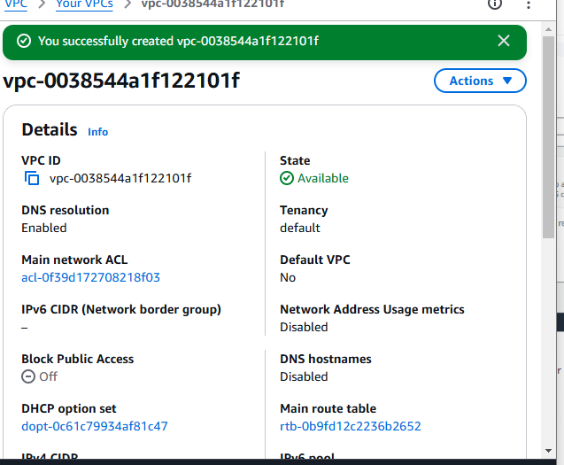
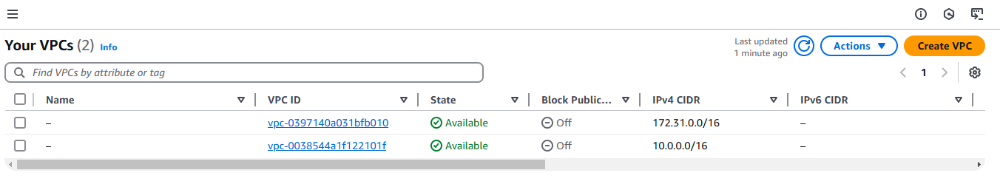
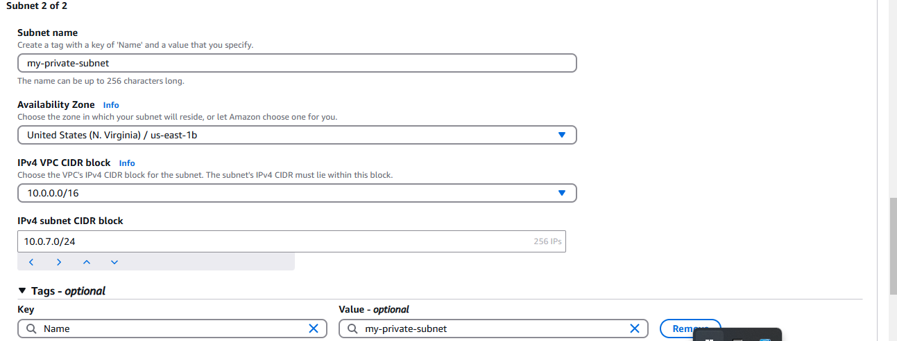
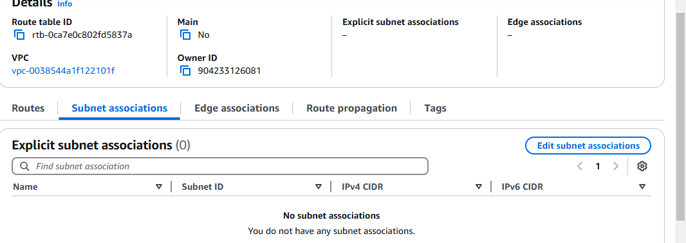

# AWS VPC Mini Project

## Project Title
**AWS VPC Setup and VPC Peering Configuration**

## Project Description
This mini project demonstrates the creation and configuration of Virtual Private Clouds (VPCs) in AWS, along with essential networking components and VPC peering. The setup involves creating a custom VPC, subnet, and route table, and establishing a secure and functional communication link between two VPCs using VPC peering (Requester and Accepter).

## Objectives
- Create a custom VPC
- Create a subnet within the VPC
- Create and associate a route table
- Set up VPC peering between two VPCs (Requester and Accepter)
- Modify route tables to allow traffic between VPCs

---

## Project Steps

### 1. Create a VPC
- Navigate to **VPC Dashboard** in the AWS Management Console
- Click on **Create VPC**
- Configure the following:
  - **Name tag**: `RequesterVPC` or `AccepterVPC`
  - **IPv4 CIDR block**: e.g., `10.0.0.0/16`
  - Select **default tenancy**
- Click **Create VPC**

### 2. Create a Subnet
- Under **Subnets**, click **Create subnet**
- Select the VPC you created
- Provide:
  - **Name tag**: e.g., `RequesterSubnet`
  - **Availability Zone**: any preferred AZ
  - **IPv4 CIDR block**: e.g., `10.0.1.0/24`
- Click **Create subnet**

### 3. Create a Route Table
- Go to **Route Tables** in the VPC dashboard
- Click **Create route table**
- Configure:
  - **Name tag**: e.g., `RequesterRouteTable`
  - **VPC**: select the previously created VPC
- Click **Create**
- Associate the route table with the subnet

### 4. Set Up VPC Peering
- Go to **Peering Connections**
- Click **Create peering connection**
- Configure:
  - **Name tag**: e.g., `Requester-to-Accepter`
  - **VPC (Requester)**: select the requester's VPC
  - **VPC (Accepter)**: select the accepter’s VPC (can be same or another AWS account)
- Click **Create Peering Connection**
- Select the connection and click **Actions > Accept request**

### 5. Update Route Tables
- Edit the route tables of both VPCs
- Add a new route to direct traffic to the other VPC via the peering connection
  - **Destination**: CIDR of the other VPC
  - **Target**: VPC Peering Connection ID

---

## Outcome
At the end of this project:
- You will have two VPCs with successful VPC peering
- Each VPC can communicate with the other via its private IPs
- Proper subnets and route tables are configured to allow traffic flow

---

## Screenshots

### VPC Creation

### Subnet Creation

### Route Table Association

### VPC Peering Request

### VPC Peering Acceptance

### Updated Route Table for Peering

---

## Author
**Ivang Silas Onda**

---

## License
This project is for educational purposes only.
