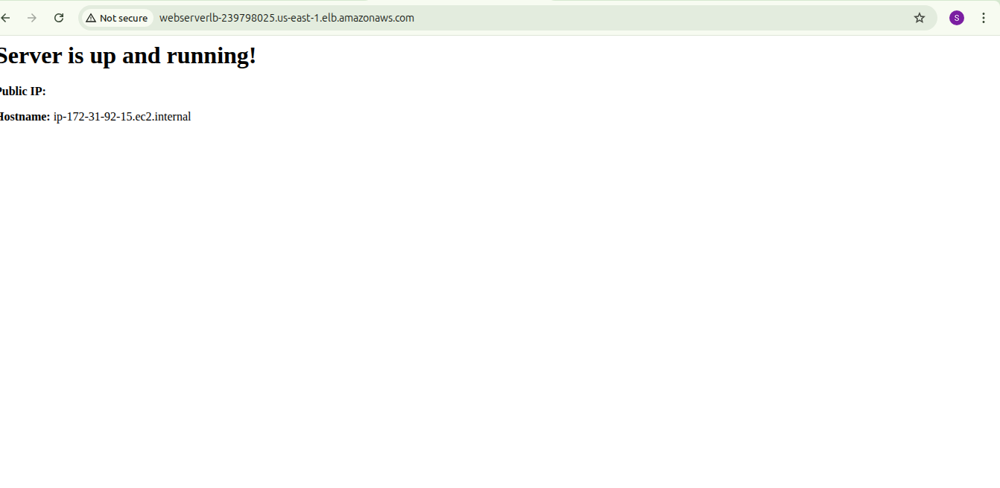

# 🚀 Configuring Auto Scaling with Load Balancer Using Launch Template

This mini-project demonstrates how to configure **Auto Scaling** in AWS using a **Launch Template**, and attach it to an **Application Load Balancer (ALB)** for high availability and dynamic scalability.

---

## 🪰 Prerequisites

Before you begin, make sure you have:

- An AWS account
- AWS CLI configured (optional but helpful)
- A **VPC** with at least **two subnets in different AZs**
- A **key pair** to SSH into your EC2 instances (optional for testing)
- A **security group** that allows HTTP (port 80) and optionally SSH (port 22)

---

## 📦 Project Overview

We will:

1. Create a **Launch Template** with User Data to install and run a web server
2. Create a **Target Group**
3. Create an **Application Load Balancer**
4. Create an **Auto Scaling Group** that uses the launch template and target group
5. Test the setup and observe Auto Scaling in action

---

## 📝 Step-by-Step Instructions

### 🔹 1. Create a Launch Template

- Go to EC2 Console → Launch Templates → **Create Launch Template**
- Template name: `web-server-template`
- AMI: Amazon Linux 2
- Instance type: `t2.micro` (Free Tier eligible)
- Key pair: select your key
- Security group: allow HTTP and optionally SSH
- **User Data**:
  ```bash
  #!/bin/bash
  yum update -y
  yum install -y httpd
  systemctl enable httpd
  systemctl start httpd
  PUBLIC_IP=$(curl -s http://169.254.169.254/latest/meta-data/public-ipv4)
  HOSTNAME=$(hostname)
  echo "<html><h1>Server is up and running!</h1><p>Public IP: $PUBLIC_IP</p><p>Hostname: $HOSTNAME</p></html>" > /var/www/html/index.html
  ```
- Click **Create launch template**

---

### 🔹 2. Create a Target Group

- Go to EC2 → Target Groups → **Create Target Group**
- Target type: **Instances**
- Name: `web-target-group`
- Protocol: HTTP, Port: 80
- VPC: Select your VPC
- Health check path: `/`
- Click **Create target group**

---

### 🔹 3. Create an Application Load Balancer

- Go to EC2 → Load Balancers → **Create Load Balancer**
- Select **Application Load Balancer**
- Name: `web-alb`
- Scheme: Internet-facing
- Listeners: HTTP on port 80
- Availability Zones: Select at least 2 subnets in different AZs
- Security group: Use same as in Launch Template
- Routing: Choose existing target group (`web-target-group`)
- Click **Create Load Balancer**

---

### 🔹 4. Create the Auto Scaling Group

- Go to EC2 → Auto Scaling Groups → **Create Auto Scaling group**
- Name: `web-asg`
- Launch Template: `web-server-template` (select version)
- VPC: Choose your VPC
- Subnets: Choose same subnets used in ALB
- Load Balancing: Attach to **existing ALB**, choose **web-target-group**
- Desired Capacity: 2 (for example)
- Minimum: 1, Maximum: 3
- Click **Create Auto Scaling Group**

---

### 🔹 5. Verify and Test

1. **Go to EC2 → Instances**
   - Verify 2 instances are running
   - Click an instance → connect if needed

2. **Go to Load Balancer DNS**
   - In EC2 → Load Balancers → Copy DNS name
   - Open it in browser:  
     `http://<alb-dns-name>`
   - You should see the message:
     ```
     Server is up and running!
     Public IP: <ip>
     Hostname: <hostname>
     ```

3. **Terminate an Instance**
   - Go to EC2 → Instances → Select one → Terminate
   - Go to **Auto Scaling Group → Activity**
   - A new instance should be launched automatically

---

## 📷 Screenshots

### ✅ Launch Template Created


### ✅ Ami Selected


### ✅ Auto scaling group


### ✅ Launch template


### ✅ Load balancer

### ✅ Security group

### ✅ web result

### ✅ Stress test

### ✅ stress test

### ✅ User data


---

## ✅ Expected Behavior

| Test | Expected Result |
|------|------------------|
| Initial launch | Desired number of instances are running |
| User data | App or server installed and accessible |
| Terminate instance | ASG replaces it automatically |
| Scale out/in | ASG adds/removes instances based on policy |
| Load Balancer | Routes traffic to healthy instances |

---

## 📌 Notes

- Ensure your security group allows inbound traffic on port 80
- Make sure instances have public IPs if you're testing from outside the VPC
- Health checks must return HTTP 200, or the instance will be marked unhealthy

---

## 🚀 Conclusion

This project successfully demonstrates how to:
- Launch a scalable and fault-tolerant web server
- Use Launch Templates and Target Groups
- Leverage Application Load Balancers and Auto Scaling

You now have a solid template to build upon for production-ready infrastructure in AWS.

