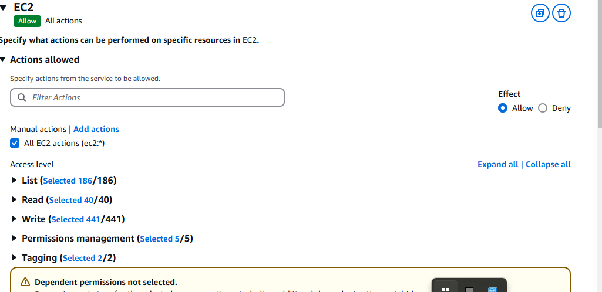
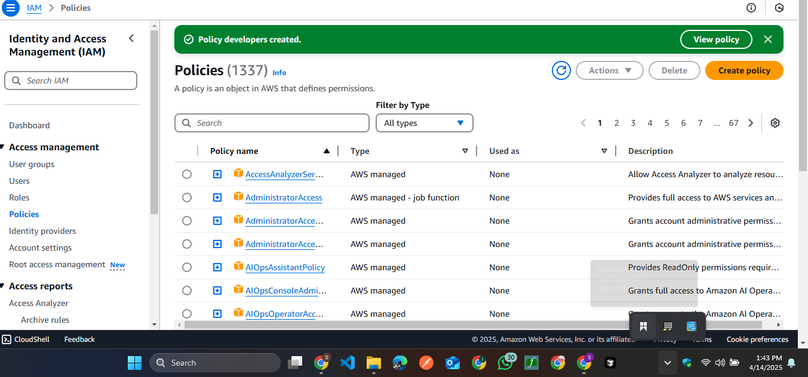
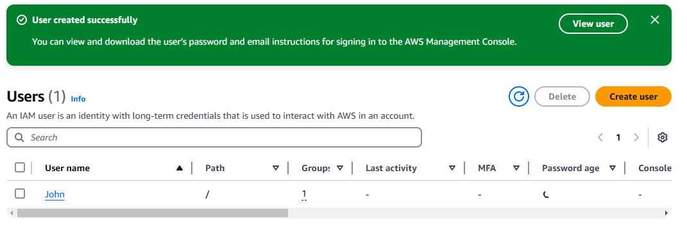

# 🛡️ AWS Security and Identity Management (IAM) – Mini Project

## 📚 Overview

This mini project explores **AWS Identity and Access Management (IAM)**, focusing on how it helps secure AWS environments by controlling access to AWS services and resources. Through hands-on implementation, I created users, groups, and policies, and applied best practices like the principle of least privilege and multi-factor authentication (MFA).

---

## 📌 Learning Objectives

1. Understand the Role of IAM in AWS  
2. Differentiate Between IAM Users and Groups  
3. Create and Attach IAM Policies  
4. Configure IAM Users and Groups Based on Roles  
5. Implement Security Best Practices (MFA, Least Privilege)

---

## 🧠 What I Learned

### 1. 🔐 Role of IAM in AWS

IAM is a foundational security service in AWS. It allows you to:
- Control who is authenticated (signed in) and authorized (has permissions) to use AWS resources.
- Create and manage IAM users and groups.
- Set fine-grained permissions using JSON-based policies.

IAM is critical for securing AWS accounts and managing access to services and resources in a scalable, secure manner.

---

### 2. 👤 IAM Users vs 👥 IAM Groups

| Feature        | IAM User                            | IAM Group                             |
|----------------|--------------------------------------|----------------------------------------|
| Definition     | An individual identity in AWS       | A collection of IAM users              |
| Use Case       | Used for individual access          | Used to assign common permissions      |
| Policy Assignment | Direct or via group               | Policies attached to group, inherited by users |

---

### 3. 🛠️ Creating IAM Policies

Policies are JSON documents that define what actions are allowed or denied on AWS resources.

#### ✅ Developer Policy
- **Name**: `DeveloperFullAccess`
- **Description**: Grants full access to EC2
- **Permissions**:  
  ```json
  {
    "Version": "2012-10-17",
    "Statement": [
      {
        "Effect": "Allow",
        "Action": "ec2:*",
        "Resource": "*"
      }
    ]
  }


✅ Analyst Policy
Name: DataAnalystReadS3

Description: Grants read access to specific S3 bucket

Permissions:

{
  "Version": "2012-10-17",
  "Statement": [
    {
      "Effect": "Allow",
      "Action": [
        "s3:ListBucket",
        "s3:GetObject"
      ],
      "Resource": [
        "arn:aws:s3:::your-bucket-name",
        "arn:aws:s3:::your-bucket-name/*"
      ]
    }
  ]
}


4. 👥 Groups and Users Configuration
Groups Created:
development_team

data-analyst

Users Created:
John – Developer

Assigned to development_team group

Granted full EC2 access via group policy

MFA enabled

Mary – Data Analyst

Assigned to data-analyst group

Granted read-only access to S3

MFA enabled


5. 🔐 Principle of Least Privilege (PoLP)
The principle of least privilege states that a user should be granted only the permissions they need to complete their tasks—and nothing more. This reduces security risks and limits the impact of potential breaches.

Implementation in this project:

John has full access to EC2 only (developer role)

Mary has read access to specific S3 buckets only (analyst role)

No unnecessary permissions were granted


6. ✅ Job Role Alignment
### 👥 IAM Users and Role Alignment

| User | Role         | Group            | Permissions Granted     | Justification                                                |
|------|--------------|------------------|--------------------------|--------------------------------------------------------------|
| John | Developer    | development_team | Full EC2 access          | Needs to deploy, manage, and terminate EC2 instances         |
| Mary | Data Analyst | data-analyst     | Read-only access to S3   | Needs access to retrieve and analyze stored data             |

🚀 Key Takeaways
IAM is essential for managing access securely in AWS.

Using groups simplifies permission management and scales better.

Following best practices like least privilege and MFA significantly enhances security.

Aligning IAM roles and permissions with actual job responsibilities leads to better access control and operational efficiency.

ScreenShot











