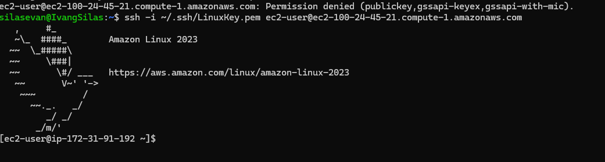
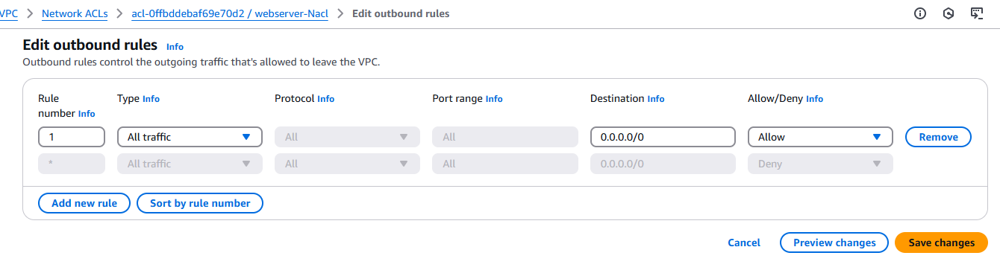

# 🛡️ Security Groups and NACL in AWS

## 📌 Project Overview

This mini project explores the concepts and practical usage of **Security Groups** and **Network Access Control Lists (NACLs)** in **Amazon Web Services (AWS)**. As part of my hands-on learning, I worked through various scenarios that demonstrate how these components control traffic flow to and from AWS resources such as EC2 instances.

---

## 📚 What I Learned

### 🔐 Security Groups
- Security Groups act as **virtual firewalls** for EC2 instances to control **inbound and outbound** traffic.
- They are **stateful**, meaning return traffic is automatically allowed regardless of outbound rules.

#### ✅ Key Concepts:
- Default inbound and outbound configurations.
- How to **allow/deny specific IP ranges and ports**.
- Testing the behavior when **inbound or outbound rules are removed**.

### 🌐 Network ACLs (NACLs)
- NACLs provide an **optional layer of security** at the **subnet level**.
- They are **stateless**, so return traffic must be explicitly allowed via rules.

#### ✅ Key Concepts:
- Differentiating between **inbound and outbound rules**.
- Understanding **rule evaluation order** (by rule number).
- Experimenting with **allowing and denying** traffic by specific ports and IPs.
- Observing impact when all inbound or outbound rules are deleted.

---

## 🧪 Scenarios Explored

### 🔄 Scenario 1: Removing Inbound Rules from Security Group
- Removed all inbound rules and tested EC2 instance accessibility.
- Outcome: Instance becomes unreachable via SSH and HTTP.

### ⛔ Scenario 2: Removing Outbound Rules from Security Group
- Deleted outbound rules to observe effects on instance updates and external communication.
- Outcome: EC2 could not access the internet or update packages.

### 🔁 Scenario 3: Default NACL vs Custom NACL
- Compared behavior of default NACL with a newly created NACL.
- Outcome: Confirmed that NACLs apply rules at the subnet level and need explicit allow rules for both directions.

### 🧱 Scenario 4: Denying a Specific IP Using NACL
- Added a deny rule for a specific IP.
- Outcome: Connection attempts from the blocked IP were rejected, verifying that **deny rules in NACLs take precedence**.

---

## 📷 Screenshots

> Paste your screenshots here below each scenario for visual reference.

### 📸 Scenario 1: No Inbound Rules (Security Group)

### 📸 Scenario 2: No Outbound Rules (Security Group)

### 📸 Scenario 3: Custom NACL Rules

### 📸 Scenario 4: Denied IP in NACL

---

## ✅ Conclusion

This project deepened my understanding of AWS network security, specifically how Security Groups and NACLs differ and work together to protect cloud infrastructure. These experiments helped solidify real-world scenarios where configurations can impact service accessibility and security.

---

