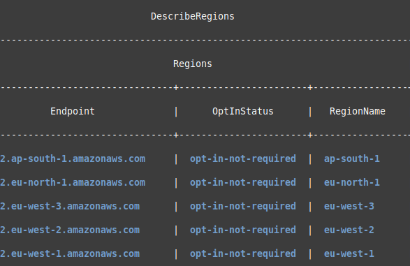

# AWS CLI, API, and Authentication Overview

This documentation provides a brief overview of the **AWS Command Line Interface (CLI)**, **AWS API**, and how to authenticate to the AWS API from your terminal.

---

## 📌 Table of Contents

* [AWS CLI](#aws-cli)

  * [Installation](#installation)
  * [Configuration](#configuration)
  * [Basic Usage](#basic-usage)
* [AWS API](#aws-api)

  * [What is the AWS API?](#what-is-the-aws-api)
  * [Common Use Cases](#common-use-cases)
* [Authentication](#authentication)

  * [Using AWS CLI for Authentication](#using-aws-cli-for-authentication)
  * [Environment Variables](#environment-variables)
  * [IAM Roles](#iam-roles)
* [Additional Resources](#additional-resources)

---

## AWS CLI

### 🎯 What is AWS CLI?

The **AWS Command Line Interface (CLI)** is a unified tool used to manage your AWS services directly from the terminal. It allows you to control AWS resources using commands instead of navigating through the AWS Management Console.

### 📥 Installation

Follow the official AWS documentation to install the CLI on your operating system:

* **Linux/macOS:**

```bash
curl "https://awscli.amazonaws.com/awscli-exe-linux-x86_64.zip" -o "awscliv2.zip"
unzip awscliv2.zip
sudo ./aws/install
```

* **Windows:**
  Download and install using the installer from the [AWS CLI official page](https://docs.aws.amazon.com/cli/latest/userguide/getting-started-install.html).

### ⚙️ Configuration

After installation, configure your AWS CLI with your credentials:

```bash
aws configure
```

You will be prompted to enter:

```
AWS Access Key ID: <your-access-key-id>
AWS Secret Access Key: <your-secret-access-key>
Default region name: <e.g., af-south-1>
Default output format: <json|yaml|text>
```


