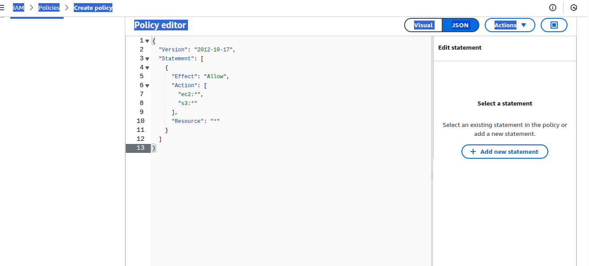
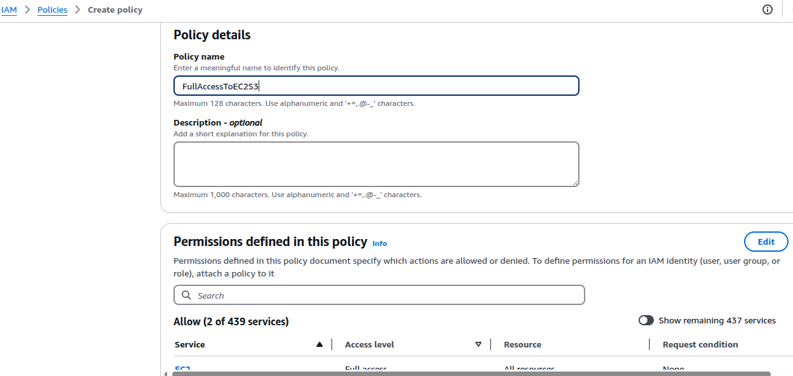
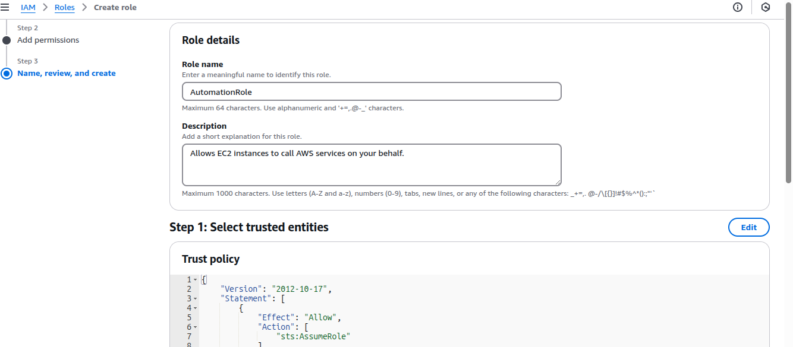
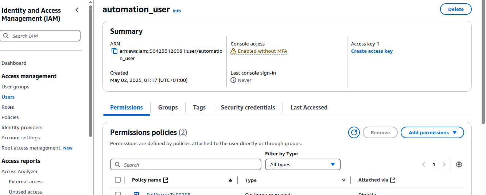

# AWS CLI, API, and Authentication Documentation

This documentation provides a comprehensive overview of the **AWS Command Line Interface (CLI)**, **AWS API**, and the authentication process, including the **creation and configuration of IAM Users, Roles, and Policies**. It follows the required guidelines and includes necessary steps and context.

---

## 📋 Table of Contents

* [IAM Role, Policy, and User Setup](#iam-role-policy-and-user-setup)

  * [Create IAM Policy](#create-iam-policy)
  * [Create IAM Role](#create-iam-role)
  * [Create IAM User and Attach Role/Policy](#create-iam-user-and-attach-rolepolicy)
* [AWS CLI](#aws-cli)

  * [Installation](#installation)
  * [Configuration](#configuration)
  * [Verification of Authentication](#verification-of-authentication)
* [AWS API Overview](#aws-api-overview)
* [Authentication Methods](#authentication-methods)
* [Best Practices](#best-practices)
* [Additional Resources](#additional-resources)

---

## IAM Role, Policy, and User Setup

### 🔐 Create IAM Policy

1. Sign in to the AWS Management Console.
2. Navigate to **IAM > Policies > Create Policy**.
3. Select **JSON** tab and paste:

```json
{
  "Version": "2012-10-17",
  "Statement": [
    {
      "Effect": "Allow",
      "Action": [
        "ec2:*",
        "s3:*"
      ],
      "Resource": "*"
    }
  ]
}
```

4. Name it `FullAccessToEC2S3` and create the policy.

### 👥 Create IAM Role

1. Go to **IAM > Roles > Create Role**.
2. Select **AWS service > EC2**.
3. Attach the `FullAccessToEC2S3` policy.
4. Name the role `AutomationRole`.

### 👤 Create IAM User and Attach Role/Policy

1. Go to **IAM > Users > Add users**.
2. Username: `automation_user`.
3. Select **Programmatic Access**.
4. Attach existing policies directly: `FullAccessToEC2S3`.
5. Complete the process and download the `.csv` containing **Access Key ID** and **Secret Access Key**.








---

## AWS CLI

### 🖥 Installation

Follow official instructions or use:

```bash
curl "https://awscli.amazonaws.com/awscli-exe-linux-x86_64.zip" -o "awscliv2.zip"
unzip awscliv2.zip
sudo ./aws/install
```


### ⚙️ Configuration

Use the credentials for `automation_user`:

```bash
aws configure
```

Provide:

* AWS Access Key ID
* AWS Secret Access Key
* Default region (e.g., `af-south-1`)
* Output format (e.g., `table`)


### ✅ Verification of Authentication

Run:

```bash
aws ec2 describe-regions --output table
```

Expected result: a table listing AWS regions.


---

## AWS API Overview

The **AWS API** provides programmatic access to AWS services via RESTful HTTP requests. It's used in conjunction with authentication credentials to perform actions such as launching EC2 instances or managing S3 buckets.

### 🔧 Example API Call (Signed)

```bash
curl -X POST "https://ec2.af-south-1.amazonaws.com" \
-H "Content-Type: application/x-www-form-urlencoded" \
-d "Action=DescribeInstances&Version=2016-11-15"
```

> Note: Signature Version 4 signing is required and is handled by AWS CLI and SDKs automatically.

---

## Authentication Methods

### 1. **Using AWS CLI**

AWS CLI automatically signs requests using the stored credentials.

### 2. **Environment Variables**

```bash
export AWS_ACCESS_KEY_ID=your_access_key
export AWS_SECRET_ACCESS_KEY=your_secret_key
export AWS_DEFAULT_REGION=af-south-1
```

### 3. **IAM Role (for EC2)**

* Attach IAM role (`AutomationRole`) to EC2 instance.
* Use instance metadata for credentials:


