# High Availability WordPress Website on AWS

This documentation provides detailed steps on how to set up a high availability WordPress website on AWS, leveraging EC2 instances, RDS (Relational Database Service), EFS (Elastic File System), Load Balancer, and Auto Scaling Group to ensure fault tolerance and scalability.

---

## Prerequisites
- An AWS account.
- Basic knowledge of AWS services such as EC2, RDS, S3, and Load Balancer.
- Access to the AWS Management Console.

---

## Overview of the Architecture

- **EC2 Instances**: We will launch an EC2 instance for hosting the WordPress application.
- **RDS**: Amazon RDS will host the WordPress database for centralized data storage.
- **EFS**: Elastic File System will provide shared storage for media files uploaded to WordPress.
- **Load Balancer**: An Application Load Balancer (ALB) will distribute incoming traffic across EC2 instances to ensure high availability.
- **Auto Scaling Group**: Auto Scaling will automatically adjust the number of EC2 instances based on traffic load, ensuring scalability.

---

## Step-by-Step Guide

### Step 1: Launch an EC2 Instance (WordPress Application)
1. **Navigate to EC2 Dashboard** in AWS Management Console.
2. **Launch a New EC2 Instance**:
   - Choose an Amazon Linux 2 AMI (or another preferred distribution).
   - Select an **instance type** (e.g., `t2.micro` for testing).
   - Configure the **Security Group** to allow HTTP (80), HTTPS (443), and SSH (22) access.
   - Add **storage** (a minimum of 8GB should suffice).
3. **Install LAMP Stack** (Linux, Apache, MySQL, PHP):
   - SSH into the instance.
   - Run the necessary commands to install Apache, MySQL, and PHP.

   ```bash
   sudo yum update -y
   sudo yum install -y httpd mariadb-server php php-mysqlnd php-fpm
   sudo systemctl start httpd
   sudo systemctl enable httpd
   sudo systemctl start mariadb
   sudo systemctl enable mariadb
   ```

4. **Install WordPress**:
   - Download the WordPress files and configure them.

   ```bash
   cd /var/www/html
   wget https://wordpress.org/latest.tar.gz
   tar -xvzf latest.tar.gz
   sudo mv wordpress/* /var/www/html/
   sudo chown -R apache:apache /var/www/html/
   ```

### Step 2: Set Up Amazon RDS (MySQL Database)
1. **Navigate to the RDS Dashboard**.
2. **Create a New DB Instance**:
   - Select **MySQL** as the database engine.
   - Choose an instance class (e.g., `db.t3.micro` for low usage).
   - Configure the DB with a **DB Identifier** (e.g., `wordpress-db`), **Master Username** (e.g., `admin`), and a **Master Password**.
3. **Configure Security Group** to allow inbound traffic from the EC2 instance (allowing MySQL port 3306).
4. **Create the Database** and note the **endpoint** (e.g., `wordpress-db.c2vm8m2euuke.us-east-1.rds.amazonaws.com`).

### Step 3: Set Up Amazon EFS (Elastic File System) for Shared Storage
1. **Navigate to the EFS Dashboard**.
2. **Create a New EFS File System**:
   - Choose a VPC (Virtual Private Cloud) and subnet for the EFS mount.
   - Select the appropriate **Access Points** for access.
3. **Mount the EFS on EC2**:
   - SSH into the EC2 instance.
   - Install the necessary EFS utilities.

   ```bash
   sudo yum install -y amazon-efs-utils
   ```

   - Mount the EFS file system.

   ```bash
   sudo mkdir -p /mnt/efs
   sudo mount -t efs fs-xxxx:/ /mnt/efs
   ```

4. **Create a symbolic link for WordPress uploads**:
   - Create the necessary directories and link them to the EFS mount.

   ```bash
   sudo mkdir -p /mnt/efs/wp-content/uploads
   sudo ln -s /mnt/efs/wp-content/uploads /var/www/html/wp-content/uploads
   sudo chown -R apache:apache /mnt/efs/wp-content/uploads
   ```

### Step 4: Configure WordPress to Use RDS and EFS
1. **Update the wp-config.php file**:
   - Edit the `wp-config.php` to use the RDS instance for the database connection.

   ```php
   define('DB_NAME', 'wordpress-db');
   define('DB_USER', 'admin');
   define('DB_PASSWORD', 'yourpassword');
   define('DB_HOST', 'wordpress-db.c2vm8m2euuke.us-east-1.rds.amazonaws.com');
   ```

2. **Set the `uploads` path** to the EFS shared directory.
   
   WordPress will now use EFS for storing media files and RDS for database storage.

### Step 5: Set Up Load Balancer
1. **Navigate to the EC2 Dashboard** and select **Load Balancers**.
2. **Create an Application Load Balancer**:
   - Choose the **VPC** and **subnet** where your EC2 instances reside.
   - Configure **Listeners** for HTTP (port 80) and HTTPS (port 443).
   - Add your EC2 instances to the load balancer’s target group.

3. **Update the Security Group** to allow traffic from the load balancer.

### Step 6: Set Up Auto Scaling Group
1. **Navigate to EC2 Dashboard** and select **Auto Scaling Groups**.
2. **Create Auto Scaling Group**:
   - Choose the launch configuration based on the EC2 instance type.
   - Set the desired capacity (e.g., 1 instance), minimum capacity, and maximum capacity.
3. **Create a Scaling Policy** to adjust the number of EC2 instances based on CPU usage or traffic load.

---

## Testing the Setup
1. **Access WordPress via the Load Balancer URL**:
   - Navigate to the load balancer’s DNS name (e.g., `http://my-load-balancer-12345.elb.amazonaws.com`) and verify that the WordPress site is accessible.
2. **Verify WordPress Uploads**:
   - Upload a new image or plugin through the WordPress admin panel and check the `/mnt/efs/wp-content/uploads` directory on the EC2 instance to confirm that files are being stored on EFS.
3. **Scale the EC2 Instances**:
   - Simulate traffic spikes or manually scale the Auto Scaling Group to add more EC2 instances. Verify that the Load Balancer starts distributing traffic to the new instances.

---

## Troubleshooting Tips
- **Instance Not Starting**: Ensure that the security group of the EC2 instance allows traffic from the Load Balancer.
- **Database Connection Issues**: Double-check the RDS endpoint and credentials in the `wp-config.php` file.
- **EFS Mount Issues**: Verify that the EC2 instance has the necessary permissions and mount target configurations for accessing EFS.

---

## Screenshots
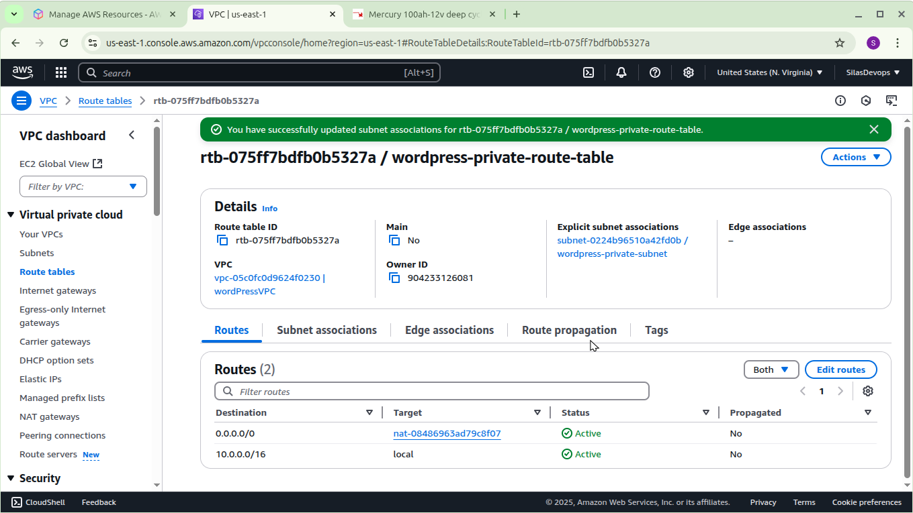
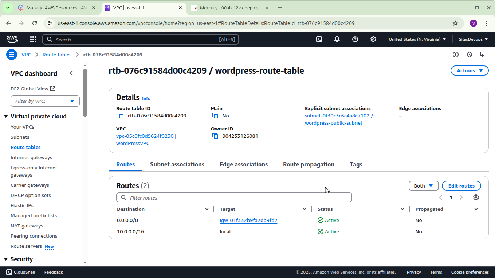
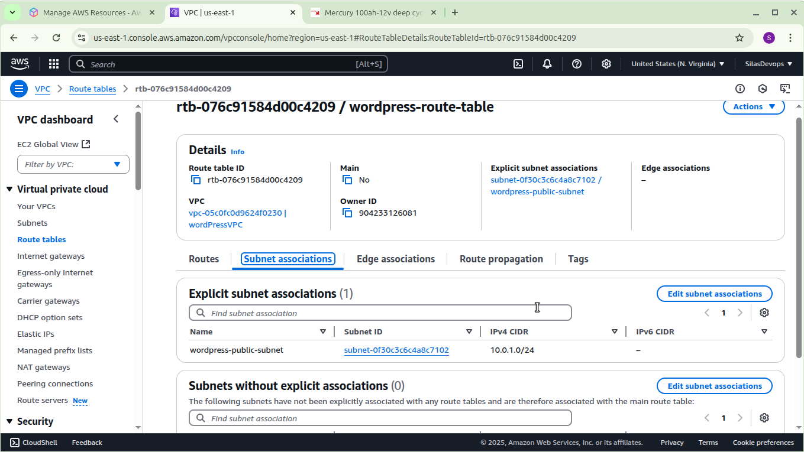
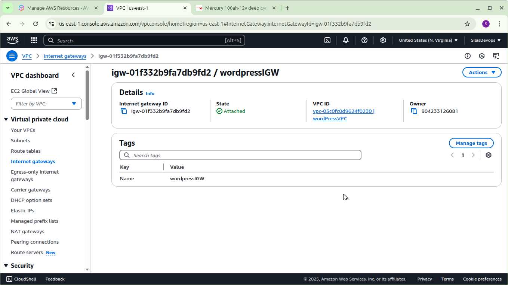
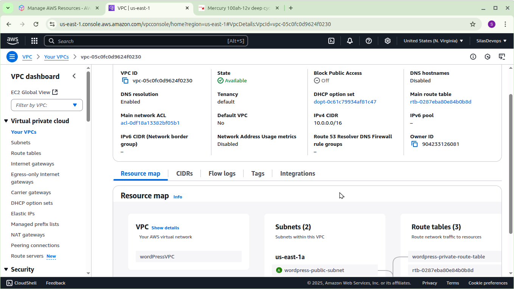
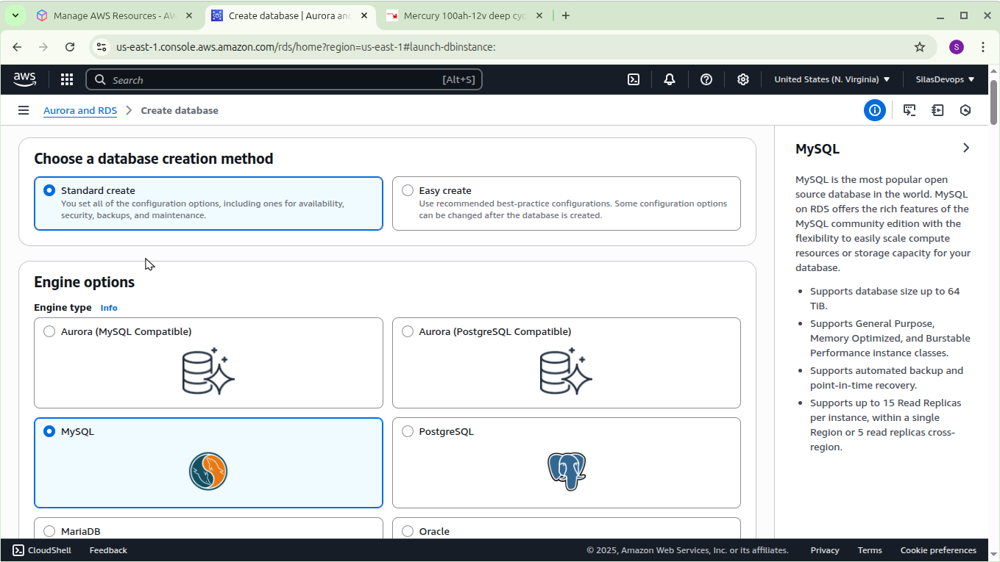
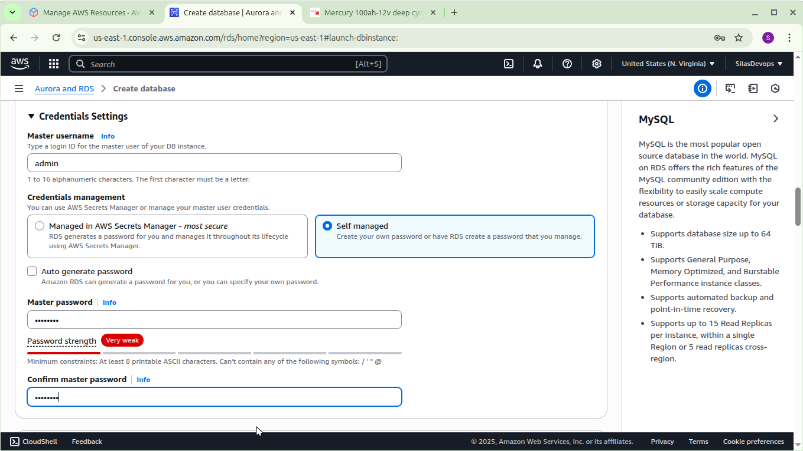
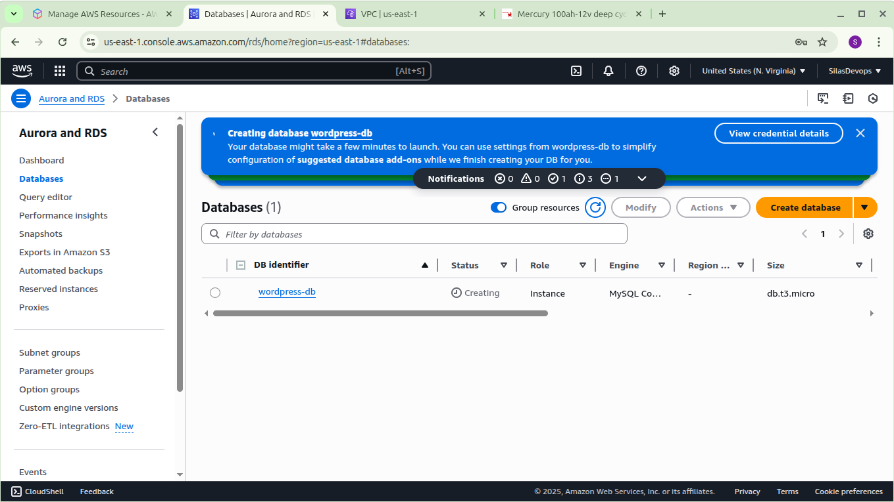
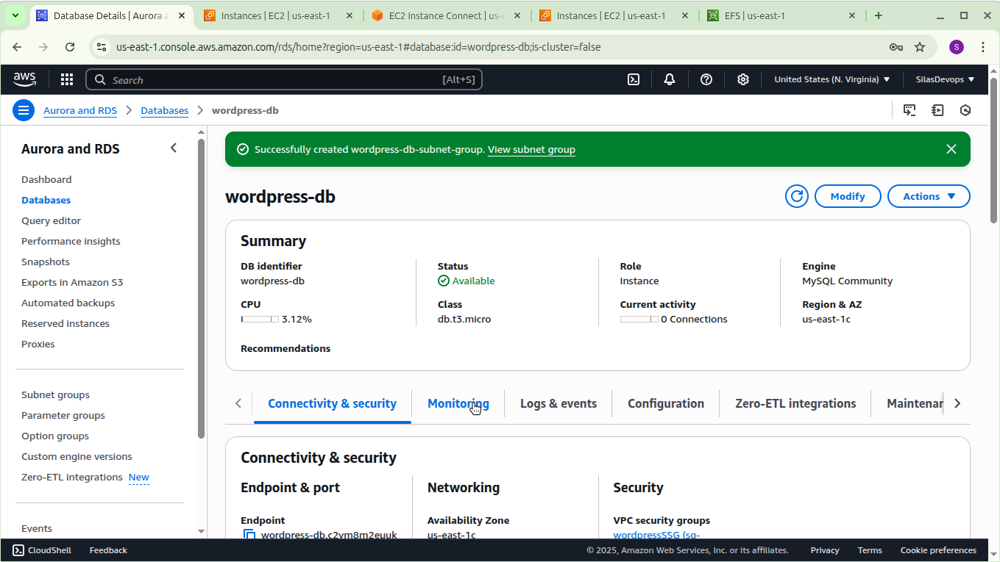
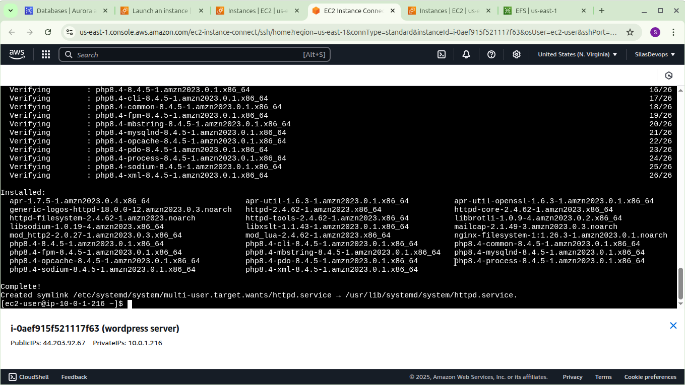
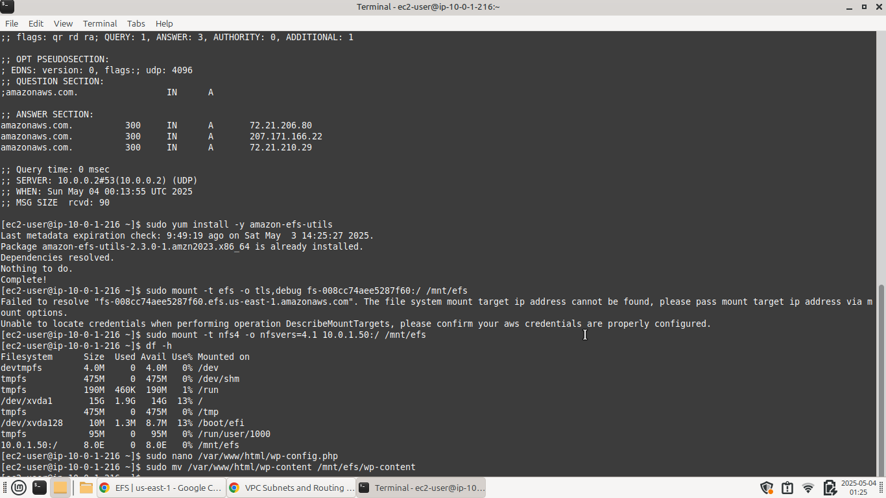

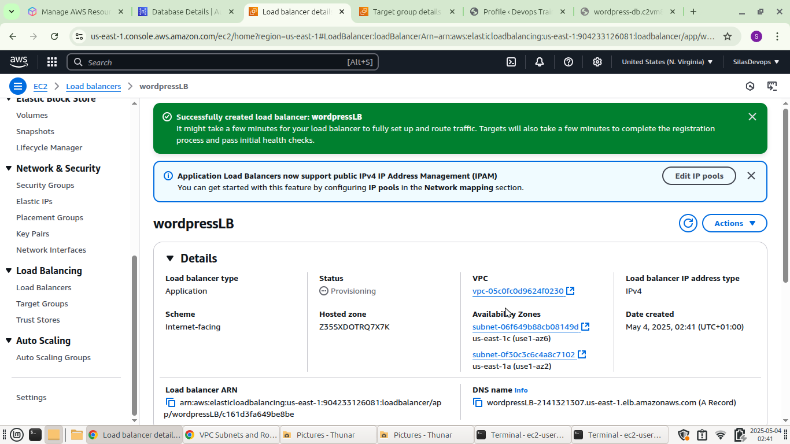
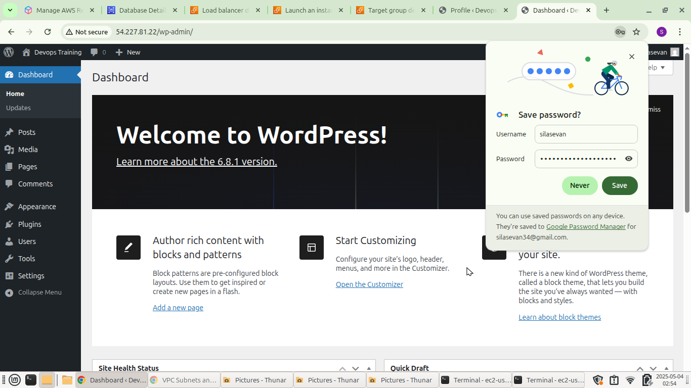
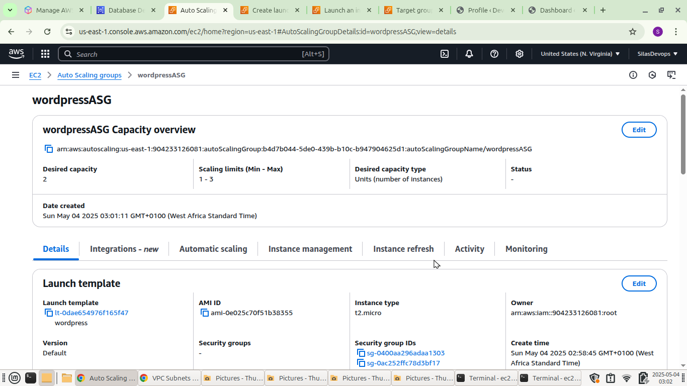
