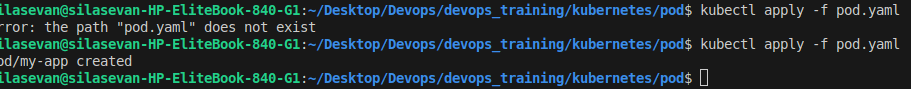
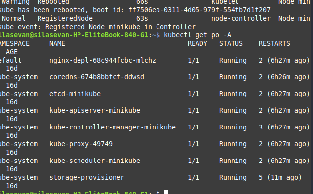
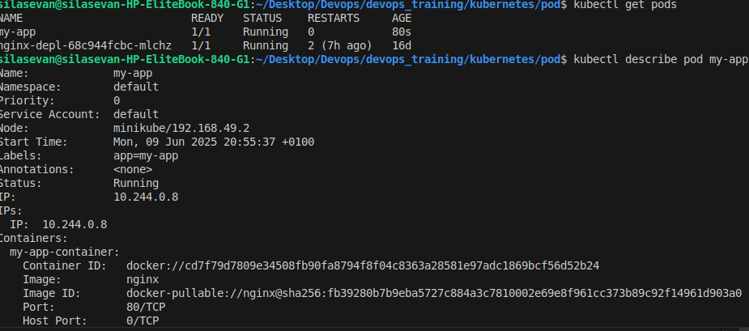
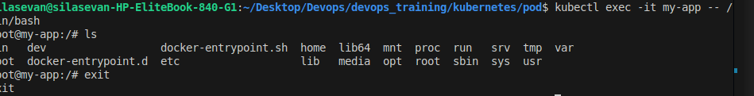
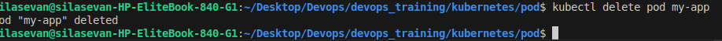

# 📘 Kubernetes Pod Management Documentation

This document provides a comprehensive guide for creating, deploying, managing, and understanding **Kubernetes Pods**. It covers everything from defining a Pod using YAML to inspecting and deleting Pods, as well as insights gained during the process.

---

## 📌 What is a Pod?

A **Pod** is the smallest deployable unit in Kubernetes. It encapsulates one or more containers that share the same network namespace, storage, and configuration. Containers in a Pod can communicate with each other using `localhost`.

---

## 🔧 Prerequisites

Ensure the following are installed and properly configured:

* Docker
* `kubectl` (Kubernetes CLI)
* A running Kubernetes cluster (e.g., Minikube, Kind, or a managed cloud Kubernetes service)

---

## 📄 Step 1: Define a Pod with Containers

We define a simple Pod with an **NGINX** container:

**`pod.yaml`**:

```yaml
apiVersion: v1
kind: Pod
metadata:
  name: my-nginx
  labels:
    app: web
spec:
  containers:
    - name: nginx-container
      image: nginx
      ports:
        - containerPort: 80
```

---

## 🚀 Step 2: Deploy the Pod

Use the following command to deploy the Pod:

```bash
kubectl apply -f pod.yaml
```

📸 *Screenshot: Pod deployed successfully*



---

## 🔍 Step 3: List All Pods in the Cluster

To list **all Pods across all namespaces**, run:

```bash
kubectl get po -A
```

📸 *Screenshot: Listing all Pods*



---

## 🔎 Step 4: Describe the Pod

To inspect the internal details of a specific Pod:

```bash
kubectl describe pod my-nginx
```

This command provides detailed information including status, events, container image, and ports.

📸 *Screenshot: Describing the Pod*



---

## 🧑‍💻 Step 5: Access the Running Container

To interact with the container inside the Pod:

```bash
kubectl exec -it my-nginx -- /bin/bash
```

You will be placed inside the container’s shell where you can run commands like `nginx -v`, `ls`, etc.

📸 *Screenshot: Exec into container*



---

## ❌ Step 6: Delete the Pod

To remove the Pod from the cluster:

```bash
kubectl delete pod my-nginx
```

📸 *Screenshot: Deleting the Pod*



---

## 📦 Understanding Containers in Pods

* A **Pod** can have one or more containers.
* All containers in a Pod **share the same IP address**, **hostname**, and **volumes**.
* Containers are managed as a single unit. If the Pod is restarted, **all containers** are restarted together.
* Containers within a Pod can communicate over `localhost`.

📌 **Key Point**: A Pod is not meant to be durable. If a Pod dies, it is not automatically recreated unless part of a controller like a **Deployment** or **ReplicaSet**.

---

## 🧠 Learnings & Insights

* Pods provide an abstraction over containers that makes scaling and orchestration easier.
* Using `kubectl describe` and `logs` is vital for debugging failed Pods.
* It's important to label your Pods for easier identification and management with `kubectl get pods -l <label-selector>`.
* A YAML manifest provides an easy and repeatable way to deploy Pods.
* Understanding how containers share resources in a Pod is crucial for co-locating tightly coupled services (e.g., a web server and log sidecar).

---

## 📚 Summary of Key Commands

| Task             | Command                                  |
| ---------------- | ---------------------------------------- |
| Create a Pod     | `kubectl apply -f pod.yaml`              |
| List all Pods    | `kubectl get po -A`                      |
| Describe a Pod   | `kubectl describe pod my-nginx`          |
| Access container | `kubectl exec -it my-nginx -- /bin/bash` |
| View logs        | `kubectl logs my-nginx`                  |
| Delete a Pod     | `kubectl delete pod my-nginx`            |

---

## 📸 Screenshots Index

| Screenshot           | Description                        |
| -------------------- | ---------------------------------- |
| `1_pod_apply.png`    | Applying the Pod manifest          |
| `2_get_po_all.png`   | Listing all Pods in all namespaces |
| `3_describe_pod.png` | Describing the Pod                 |
| `4_exec_bash.png`    | Executing into the Pod’s container |
| `5_delete_pod.png`   | Deleting the Pod                   |

---
📡 Kubernetes Networking with Multi-Container Pods

Kubernetes Pods can host multiple containers that need to communicate with each other closely. All containers within the same Pod share:

Network namespace: Same IP address and port space.

Volumes: Shared persistent storage if defined.

This makes inter-container communication straightforward using localhost.

🧪 Example: Web Server and Logger Sidecar

This example demonstrates a Pod with:

A main NGINX web server container.

A sidecar container running busybox to log network connections.

🔧 multi-container-pod.yaml

apiVersion: v1
kind: Pod
metadata:
  name: nginx-sidecar
spec:
  containers:
    - name: nginx
      image: nginx
      ports:
        - containerPort: 80
    - name: logger
      image: busybox
      command: ["sh", "-c", "while true; do netstat -tulnp; sleep 5; done"]

🚀 Deploy the Multi-Container Pod

kubectl apply -f multi-container-pod.yaml

📸 Screenshot: Multi-container Pod deployed

🔍 Inspect Pod and Logs

Check both containers are running:

kubectl describe pod nginx-sidecar

To check logs from the logger container:

kubectl logs nginx-sidecar -c logger

📸 Screenshot: Logger container showing netstat output

🔄 Communication Between Containers

Since both containers share the loopback interface, the logger container can observe traffic from nginx on localhost:80.

🧠 Insight

This architecture is useful for sidecar patterns like logging, monitoring, or data transformation.

Ensures low-latency, secure communication without needing Kubernetes Services or networking policies.

🔗 References

Kubernetes Pods Overview

kubectl Cheat Sheet

Kubernetes Official Docs


## 🔗 References

* [Kubernetes Pods Overview](https://kubernetes.io/docs/concepts/workloads/pods/)
* [kubectl Cheat Sheet](https://kubernetes.io/docs/reference/kubectl/cheatsheet/)
* [Kubernetes Official Docs](https://kubernetes.io/docs/)

---
