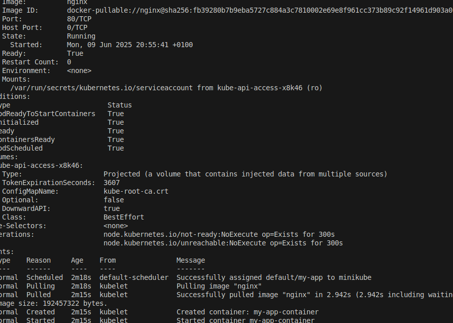

# Kubernetes Pods Guide

This documentation provides an overview and step-by-step guide on working with **Kubernetes Pods**, the smallest and simplest unit in the Kubernetes object model that you can create or deploy.

---

## 📌 What is a Pod?

A **Pod** is the smallest deployable unit in Kubernetes. It can contain one or more containers that share the same network namespace, including IP address and port space, and can communicate with each other via `localhost`.

---

## 🔧 Prerequisites

Before you begin, ensure you have the following installed:

- [Docker](https://docs.docker.com/get-docker/)
- [kubectl](https://kubernetes.io/docs/tasks/tools/)
- A Kubernetes cluster (e.g. [Minikube](https://minikube.sigs.k8s.io/docs/start/), [Kind](https://kind.sigs.k8s.io/), or a managed cloud provider like GKE, EKS, or AKS)

---





## 📂 Creating a Pod

You can create a Pod using a YAML configuration file or directly from the command line.

### ✅ Example YAML (`pod.yaml`)

```yaml
apiVersion: v1
kind: Pod
metadata:
  name: my-app
  labels:
    app: my-app
spec:
  containers:
  - name: my-app-container
    image: nginx
    ports:
    - containerPort: 80
    ```
    ````


