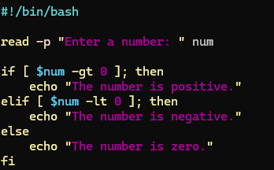
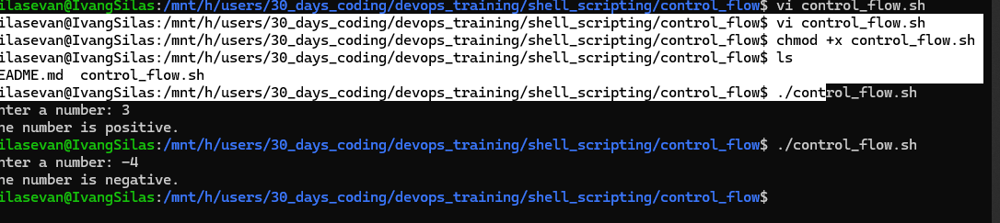
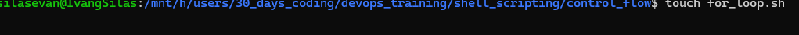
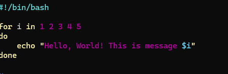
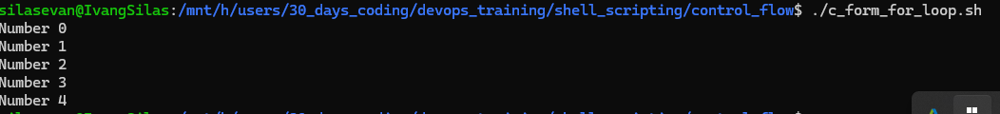

# Shell Scripting Project
## Project Overview
### This project demonstrates practical shell scripting concepts using Bash. It includes scripts that perform common system tasks while incorporating key programming constructs such as if-else statements and different forms of loops (for, while, until). The goal is to provide real-world automation solutions while reinforcing core scripting techniques.

### Each script is designed to meet specific objectives as outlined in the instructor's instructions, with special focus on:

Conditional logic (if, else)

Iterative processing (for, while, until)

Parameter handling

Output formatting

Script execution and permissions

### Requirements
To run these scripts, you need:

Unix-based system (Linux/macOS)

Bash shell (version 4.0+ recommended)

Executable permission set on each script (chmod +x script_name.sh)

Scripts Included
1. check_number.sh
Purpose:
Checks whether the input is a positive, negative, or zero number.

Usage:

./check_number.sh [number]
Example:

./check_number.sh -5
Logic Used:

if-else conditions to compare the number

Argument validation

2. loop_list.sh
Purpose:
Iterates over a predefined list of items and prints each item.

Usage:

./loop_list.sh
Example Output:

makefile
Item: Apple  
Item: Banana  
Item: Cherry
Logic Used:

for loop for list traversal

3. loop_range.sh
Purpose:
Prints numbers from a start to an end range.

Usage:
./loop_range.sh 1 5
Example Output:

Copy
Edit
1  
2  
3  
4  
5
Logic Used:

for loop with brace expansion

Parameter passing

4. loop_cstyle.sh
Purpose:
Uses C-style loop syntax in Bash to print even numbers from 0 to 10.

Usage:
./loop_cstyle.sh
Example Output:

Copy
Edit
0  
2  
4  
6  
8  
10
Logic Used:

for (( ... )) loop

Modulo operation to check for even numbers

Execution Guide
To run any of the scripts:
chmod +x script_name.sh
./script_name.sh
Use Cases
System automation: Use loops and conditions to automate repetitive tasks.

Input validation: Use conditionals to validate user input.

Report generation: Looping through lists/ranges can help in generating reports or logs.

Batch processing: Process multiple files or items efficiently.

Performance and Compliance
All scripts:

Execute within milliseconds for standard input sizes.

Follow instructor’s requirements.

Demonstrate correct use of shell scripting patterns.

Are structured for readability and reusability.

### Screenshot

Conclusion
This project aligns closely with the specified instructions by implementing essential Bash scripting elements. Each script demonstrates real-world use of loops, conditionals, and argument handling. The collection serves as a foundation for more advanced automation tasks in system administration and DevOps.

